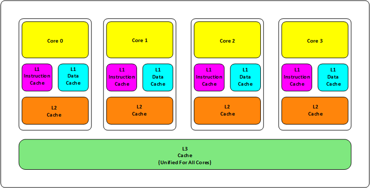

## memory arch
以存储方式区分多处理器，可以分为
1. SMP（symmetric shared-memory multiprocessor）也叫UMA（uniform memory access）

2. DSM（distributed shared memory）也叫NUMA

## cache coherency

cache一致性解决的是不同core之间的private cache的数据同步问题，有两大类方法

### snoopy
核心协议
- 写无效：当执行写操作时使其他副本无效
- 写更新：当执行写操作时同时更新所有副本

具体实现还要根据cache的设计来看，比如cache是写回还是写直达
下图是MSI协议，cache为写回法

MSI的拓展协议MSEI的一个实现[MSEI](https://www.scss.tcd.ie/Jeremy.Jones/VivioJS/caches/MESI.htm)
### directory
cache中的状态记录和snoopy相似，此外每一个存储器有一个对应的目录，目录会记录当前存储器所包含块的状态，如被哪些core的cache共享和独占
具体细节不看了

## reference
1. 计算机体系结构量化分析方法
2. [A Primer on Memory Consistency and Cache Coherence中文翻译
](https://github.com/kaitoukito/A-Primer-on-Memory-Consistency-and-Cache-Coherence
)
1. [与程序员相关的CPU缓存知识](https://coolshell.cn/articles/20793.html)
2. [重新认识cpu](https://qiankunli.github.io/2020/10/26/cpu.html)
3. [12 张图看懂 CPU 缓存一致性与 MESI 协议，真的一致吗？](https://www.cnblogs.com/pengxurui/p/16899151.html)