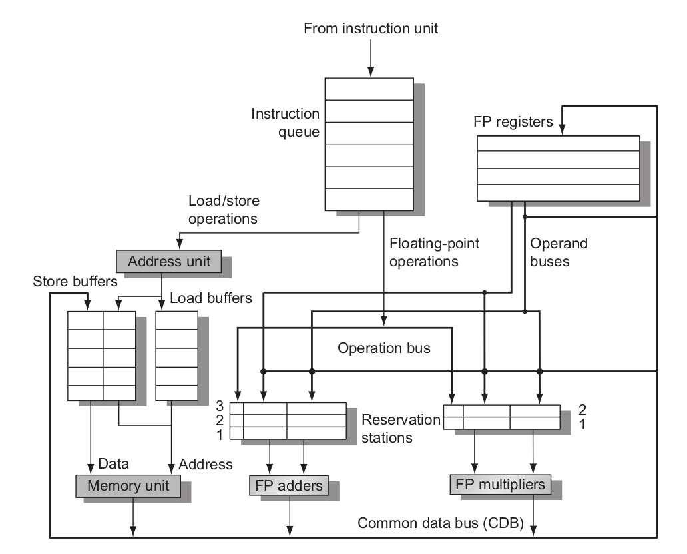
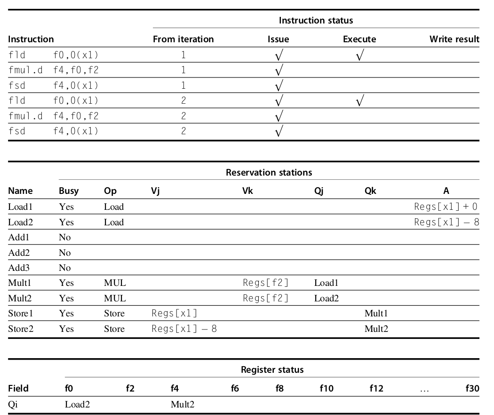
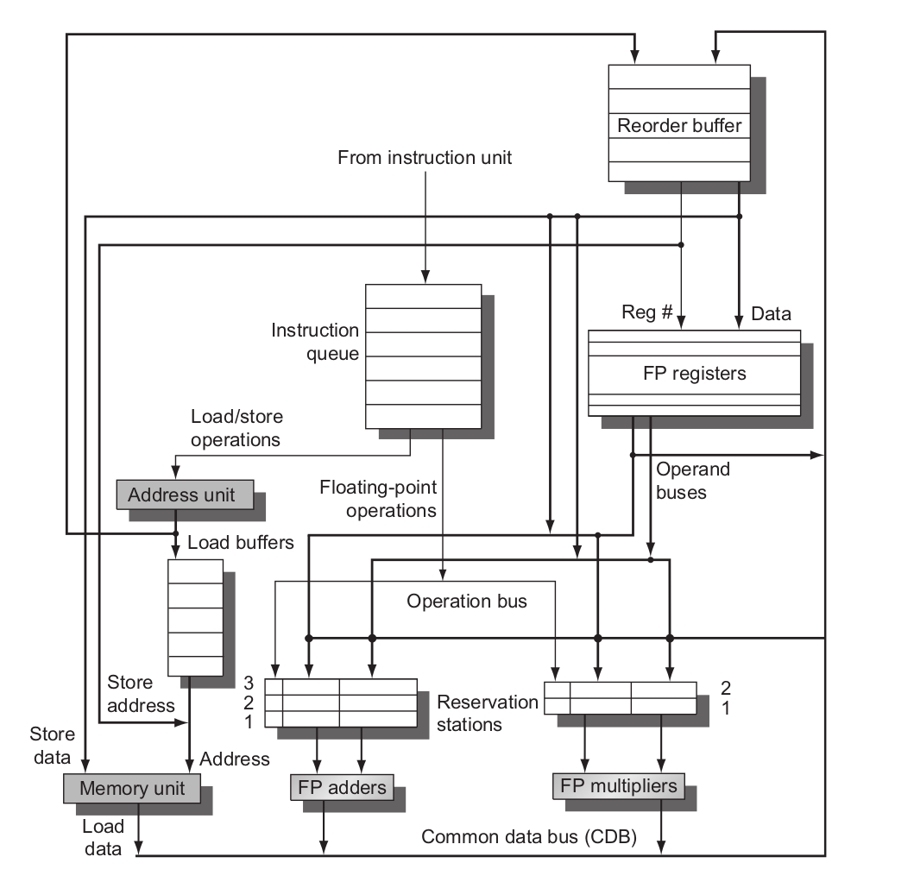
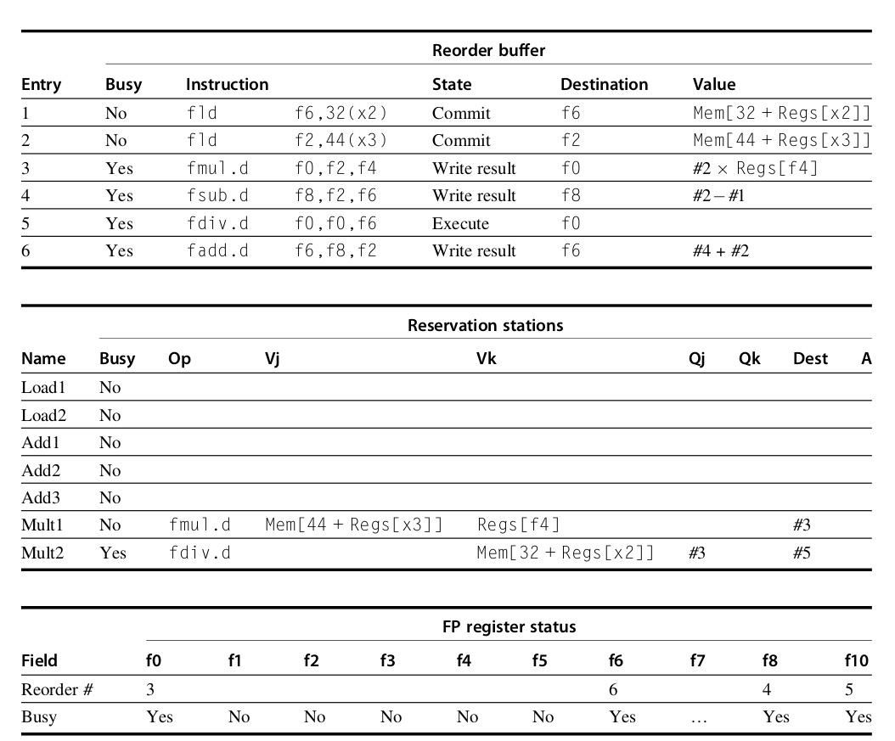

指令级并行，数据冒险,动态调度
<!--more-->
## 数据冒险
- RAW
- WAW
- WAR
RAW是真数据相关，WAW和WAR没有数据传递，可以通过寄存器重命名消除
## 经典单功能单元五段流水线
经典五段流水线只会发生RAW冒险，可以通过forwarding消除
## 多功能单元流水线
当处理器有多个功能单元时，指令发射是顺序的，但是在ID阶段（译码+读数）（读取操作数时）发生数据冒险而停顿，进入乱序执行，因此，三种数据冒险都可能发生
下面是三种动态调度的算法

## scoreboard算法

## tomasulo算法
顺序发射-乱序执行-乱序提交
tomasulo算法通过维护一个reservation station(保留站)，实现了寄存器重命名和消除RAW

## ROB
由于tomasulo算法是乱序提交，因此在分支预测错误时，难以撤销
ROB引入重排缓冲区，顺序发射-乱序执行-顺序提交

