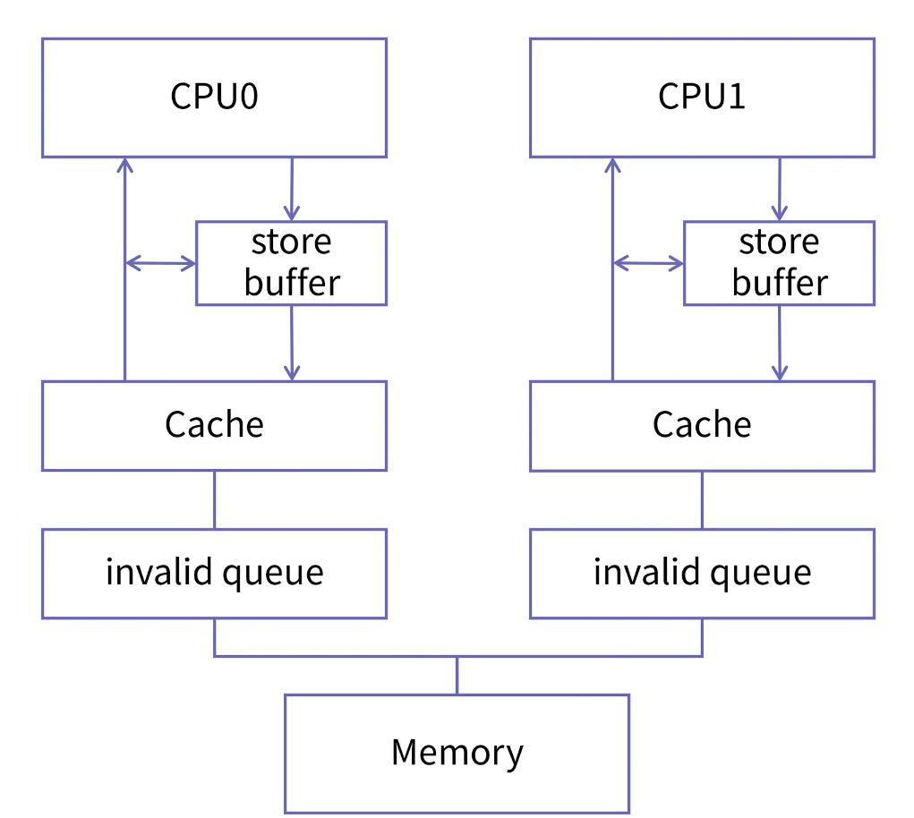
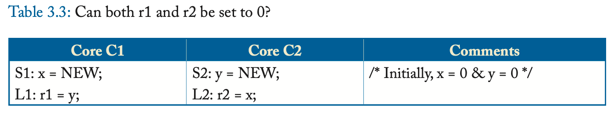
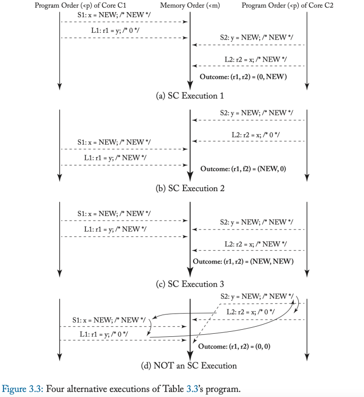
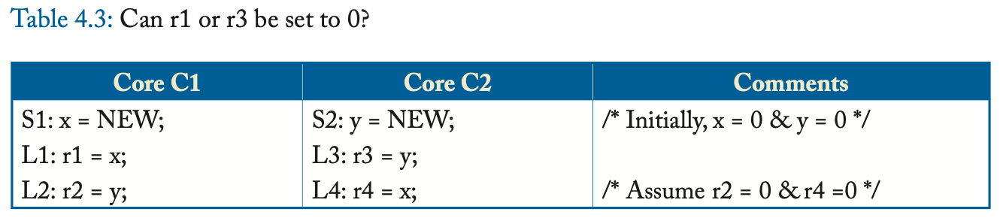
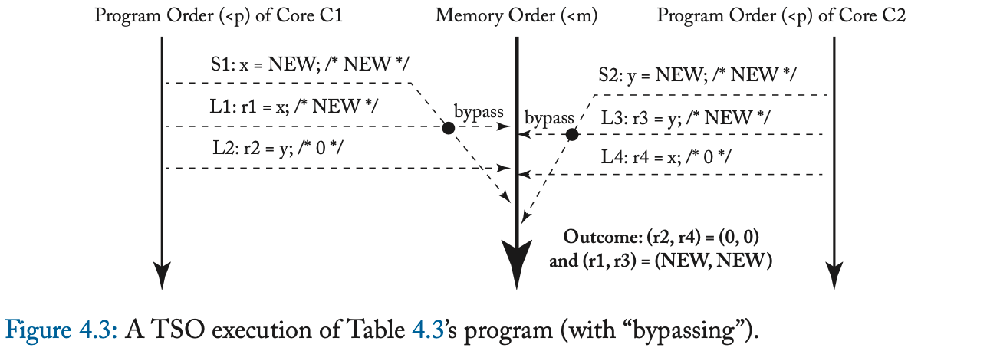

内存一致性
<!--more-->
## memory consistency
- cache coherency算法解决了cache的一致性问题，但cache一致性和memory一致性不能等同
- 现代cpu结构会有用户程序 ->编译器（指令重排）->cpu乱序执行两次指令重排，对于访存指令，不考虑cpu乱序执行的情况下，也会存在重排问题，memory consistency规定了一个架构的访存顺序

以MSI协议为例，现代体系结构提供了store buffer
- 对单线程来说，（指令序列运行在一个core上），store真正完成的顺序可能会推迟，但实际这个例子中Load可以先查询buffer，因此对单线程没有太大影响
- 对多线程来说，存在Store-Load问题，若cpu0 store A(0)，cpu1 load A时，由于store buffer，cpu1会读到旧的数据，这样尽管cache还是满足一致性（从长远来看cpu1会读到对的数据，系统会随着时间趋于一致）但是memory sequnence会发生变换，具体见sc和tso两个模型

对一个线程来说会有四种操作序列
1. load-load
2. load-store
3. store-load
4. store-store
> 架构规定硬件的memory model但为了性能，现代架构的memory model大多数为relaxed model，对程序员来说，比较容易理解的是SC ，因此在上层应用对底层memory model进行封装(加fence)
## SC
顺序一致模型为基准模型，program和memory的顺序一致

如上图一共有6中可能program序列，3中执行结果
## TSO
完全存储一致模型
放宽store-load操作序列

上图已经在第一节中描述，store-load实际执行顺序不确定对单线程没有影响，会影响多线程的执行结果

## relaxed memory model
还有一些更为宽松的内存模型，需要了再看
