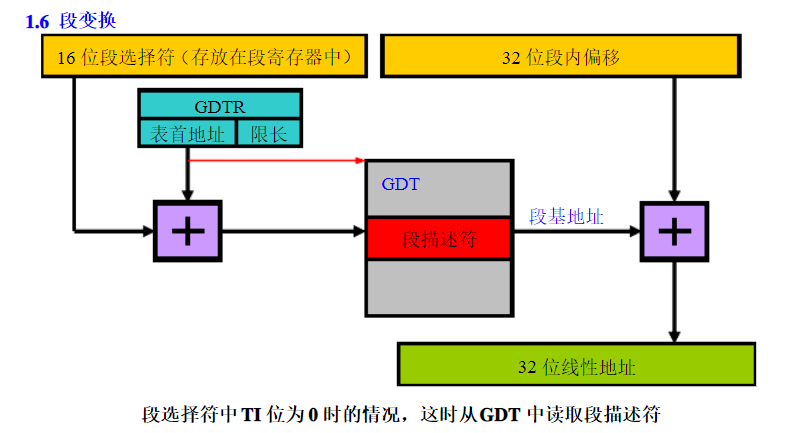
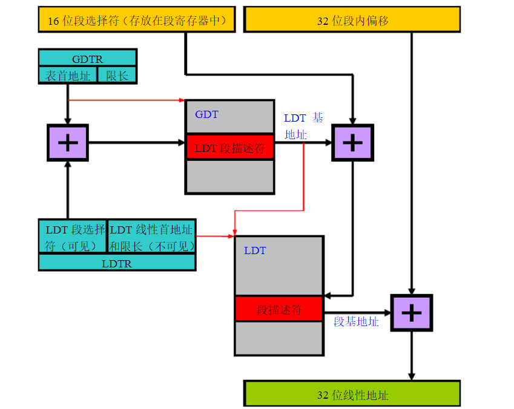
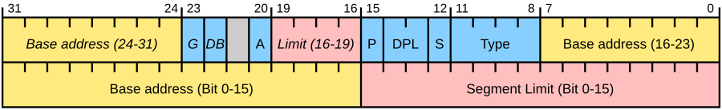
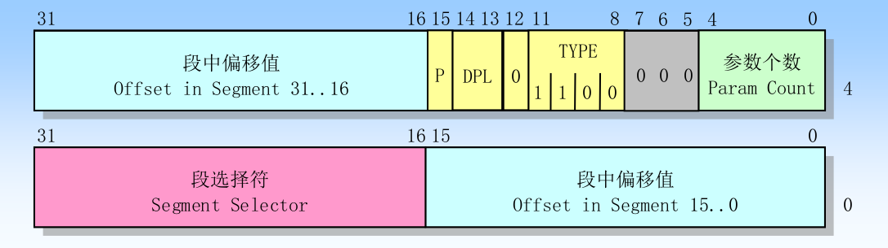
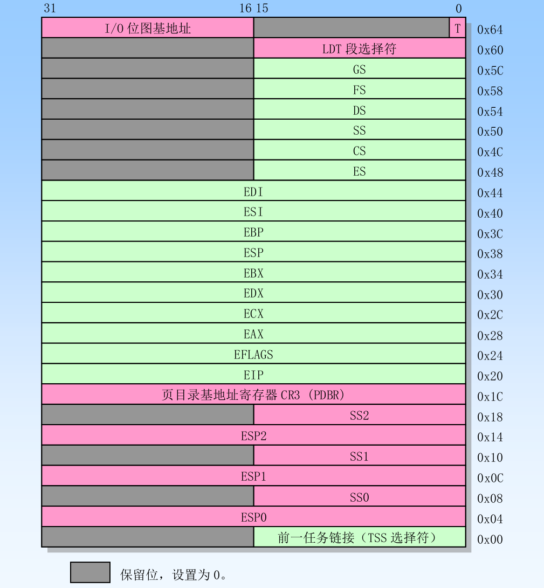

> keywords
> x86架构的内存管理是段页式内存管理
> 8086处理器，16bit，地址线20bit，使用cs:ip表示物理地址
> 80386处理器，32bit，实模式->保护模式

## GDT LDT

## 描述符
- 段描述符：代码段，数据段，堆栈段，任务段

- 门描述符:调用门，中断门，陷阱门，任务门

## 段
- cs
- ds
- ss
- tss

## 特权级
x86的特权级分为0,1,2,3，数字越小等级越高
特权级转换的规则比较复杂，这里简单概括，具体参考《linux内核完全注释5.0》