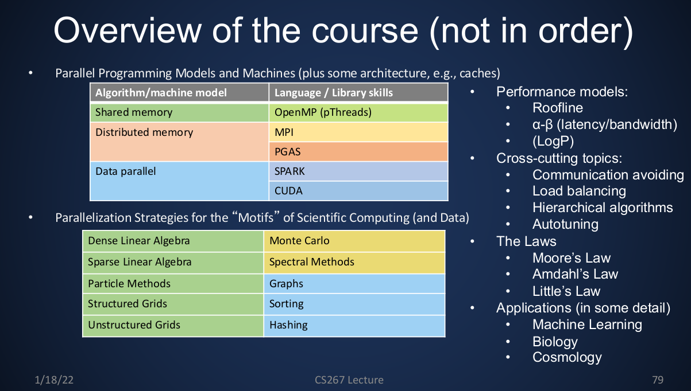
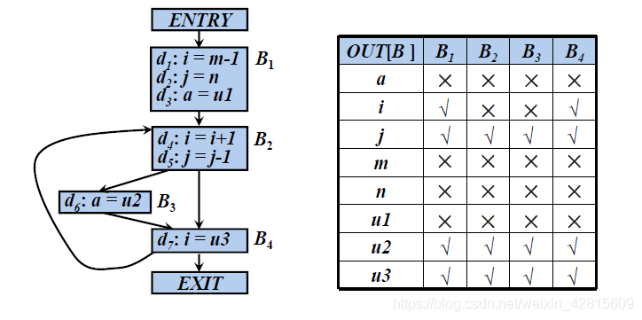

> cs267流水账
> [course](https://docs.google.com/spreadsheets/d/1bNNzAyKwrM78xmoydtWCsKrOQCW4wUOPL0LTDXZwl8E/edit#gid=1941727831)
<!--more-->
## 01 introduction

## 02 Memory Hierarchies and Matrix Multiplication
### 寄存器分配策略
#### 活跃变量分析
活跃：程序点p的变量a在某条程序流上，从p点到下一次被赋值前被使用

- IN[B]:从程序块B入口处开始的所有活跃变量
- OUT[B]:从程序块出口处的所有活跃变量，显然OUT[B]是B所有后继节点的并集

> 和编译原理Predict集好像，这类问题是逆向数据流问题
> 编译原理，寄存器分配

#### Little's Law
concurrency = latency * bandwidth
定律的目的是让系统匹配带宽，以隐藏时延。比如带宽是2bytes/s，这是系统的最大处理能力，若时延为10s，则需要20bytes
#### benchmark method
1. cache line : 设置间隔读取 
2. l1 l2 l3 : 构造数据块随机访问
### Parallelism within single processors
单处理器下的parallelism，这里是指令级并行，和数据级并行（SIMD）
1. pipeline
2. 动态调度，数据相关+分支预测
3. 多发射超标量
4. SIMD
5. 循环展开

opt
1. mem align
2. fma

### compilier opt？？？ 
### Multiple Matrix
#### analyse

由上图可以看出