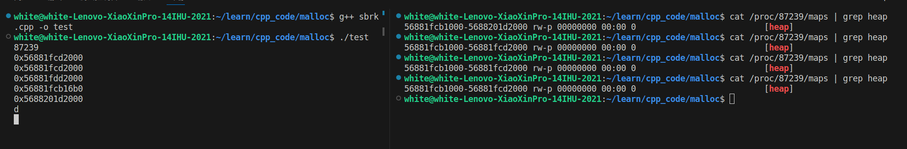

# malloc
malloc的底层实现
- 系统调用mmap和sbrk（brk），向操作系统申请堆区空间
- 维护了一个内存池，减少系统调用开销

## sbrk&brk
```cpp
#include <stdio.h>
#include <stdlib.h>
#include <unistd.h>
int main() {
    printf("%d\n", getpid());
    void* p = sbrk(0);
    void* q = sbrk(1024 * 1024);
    void* r = sbrk(1024 * 1024 * 4);
    void* s = malloc(0);
    void* t = sbrk(0);
    printf("%p\n%p\n%p\n%p\n%p\n", p, q, r, s, t);
    getchar();
    brk(p);
    getchar();
    getchar();
}
// cat /proc/89941/maps | grep heap
```

1. 通过sbrk申请内存的地址在malloc申请的地址之后
2. brk释放后页表并没有改变，即并没有向操作系统还会空间
## mmap

## malloc 实验猜测
> 不想看源码orz
1. 对齐
2. 多申请一部分空间记录大小
3. 提前通过sbrk申请一块大小的内存池，如果程序在执行过程中使用的内存小于它，直接分配，如果超过`void* p = sbrk(0);` 则通过mmap申请
4. free不一定会把内存还会操作系统（映射关系）

# new
