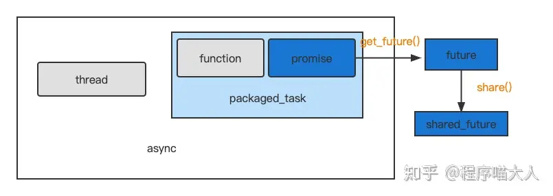

本篇学习thread最基本用法
<!--more-->
## 并发编程
### 线程传参的问题
#### 函数参数类型：
1. 向std::thread 构造函数传参：所有参数（含第1个参数可调用对象）均按值并以副本的形式保存在std::thread对象中的tuple(堆)里。
2. 向线程函数的传参：由于std::thread对象里保存的是参数的副本，为了效率同时兼顾一些只移动类型的对象，所有的副本均被std::move到线程函数，即以右值的形式传入。
> 第一个是值传递，第二是右值传递，ref是个例外，ref使其保存的是左值引用形式
```cpp
#include <cstring>
#include <iostream>
#include <mutex>
#include <thread>
using namespace std;

class myString {
   public:
    char* s;

   public:
    myString(const char _s[] = 0) {
        if (_s) {
            s = new char[strlen(_s) + 1];
            strcpy(s, _s);
        } else {
            s = new char[1];
            *s = '\0';
        }
        cout << "默认构造" << endl;
    }
    myString(const myString& _s) {
        s = new char[strlen(_s.s) + 1];
        strcpy(s, _s.s);
        cout << "拷贝构造" << endl;
    }
    myString(myString&& _s) {
        s = _s.s;
        _s.s = 0;
        cout << "移动构造" << endl;
    }
    ~myString() {
        delete[] s;
    }
    char* get_s() {
        return s;
    }
};
```
```cpp
void do_work(myString s) {
    cout << &s << endl;
    cout << static_cast<const void*>(s.s) << endl;
}

int main() {
    myString s{"hello"};
    cout << &s << endl;
    cout << static_cast<const void*>(s.s) << endl;
    std::thread t(do_work, s);
    t.join();
    return 0;
}
// 默认构造
// 0x7ffd08c32eb8
// 0x62edf7942eb0
// 拷贝构造//main.s->tuple
// 移动构造//tuple->do_work.s
// 0x746219dfed70
// 0x62edf7943300
```
```cpp
void do_work(myString& s) {
    cout << &s << endl;
    cout << static_cast<const void*>(s.s) << endl;
}

int main() {
    myString s{"hello"};
    cout << &s << endl;
    cout << static_cast<const void*>(s.s) << endl;
    std::thread t(do_work, s);
    t.join();
    return 0;
}
// error
// ok   void do_work(const myString&s)
```
```cpp
void do_work(myString&& s) {
    cout << &s << endl;
    cout << static_cast<const void*>(s.s) << endl;
}

int main() {
    myString s{"hello"};
    cout << &s << endl;
    cout << static_cast<const void*>(s.s) << endl;
    std::thread t(do_work, s);
    t.join();
    return 0;
}
// 默认构造
// 0x7ffe4ee10c78
// 0x5cf11ecbceb0
// 拷贝构造//main.s->tuple
// 0x5cf11ecbd2e8
// 0x5cf11ecbd300
```
```cpp
void do_work(myString s) {
    cout << &s << endl;
    cout << static_cast<const void*>(s.s) << endl;
}

int main() {
    myString s{"hello"};
    cout << &s << endl;
    cout << static_cast<const void*>(s.s) << endl;
    std::thread t(do_work, ref(s));
    t.join();
    return 0;
}
// 默认构造
// 0x7ffc111099b0
// 0x55931d24aeb0
// 拷贝构造//tuple->do_work.s
// 0x70c181dfed70
// 0x70c17c000b70
```
```cpp
void do_work(myString& s) {
    cout << &s << endl;
    cout << static_cast<const void*>(s.s) << endl;
}

int main() {
    myString s{"hello"};
    cout << &s << endl;
    cout << static_cast<const void*>(s.s) << endl;
    std::thread t(do_work, ref(s));
    t.join();
    return 0;
}
// 0x7ffec9d5a4e0
// 0x60048b5dbeb0
// 0x7ffec9d5a4e0
// 0x60048b5dbeb0
```
```cpp
void do_work(myString&& s) {
    cout << &s << endl;
    cout << static_cast<const void*>(s.s) << endl;
}

int main() {
    myString s{"hello"};
    cout << &s << endl;
    cout << static_cast<const void*>(s.s) << endl;
    std::thread t(do_work, ref(s));
    t.join();
    return 0;
}
//error ref使其保存左值引用形式，无法绑定到右值
```
- 第一步形参为值
- 第二步实参为右值引用
- 这里有一个问题，tuple中的ref发生隐式转换变成myString&,之后move，应该变成右值？
- `std::thread t(do_work, move(s));`

#### 可调用类型
单独写一篇

### 锁
#### 锁的类型
```cpp
#include<mutex>
metux
timed_mutex
recursive_mutex
recursive_timed_mutex

#include<shared_mutex>
shared_mutex
shared_timed_mutex

```
以上提供三个基本方法，一般不直接使用
- `void lock()`该方法可以传入锁序列，防止发生死锁
- `bool try_lock()`
- `void unlock()`

timed修饰
- `bool try_lock_for(time)`
- `bool try_lock_until(time)`

recursive修饰
- 同一线程内递归调用时防止死锁

shared修饰
- 同时代表两种类型锁，互斥锁和共享锁。上互斥锁，则不能上互斥锁和共享锁，上共享锁，可以上共享锁，但不能上互斥锁

#### 锁管理——互斥体
一旦互斥体关联锁，锁的所有权给互斥体，不能再操作锁了
- lock_guard  
  - [param]`adopt_lock`:调用之前已经上锁

- **unique_lock**  
  - 可以构造不关联锁的互斥体
  - [param]`adopt_lock`:已经上锁 
  - [param]`try_lock`:尝试之后可以使用`own_lock()`判断
  - [param]`defer_lock`:先不上锁

- **shared_lock**
还有点问题？移动语义

### 条件变量
条件变量是在获得锁后进行判断，如果不满足则释放锁，线程休眠（不会再得到锁），直到被其他线程唤醒，当再次得到锁时，重新判断条件，是一种同步机制
```cpp
#include <condition_variable>
#include <iostream>
#include <mutex>
#include <string>
#include <thread>
 
std::mutex m;
std::condition_variable cv;
std::string data;
bool ready = false;
bool processed = false;
 
void worker_thread(){
    
    std::unique_lock lk(m);
    cv.wait(lk, []{ return ready; });
 
    std::cout << "工作线程正在处理数据\n";
    data += "（处理后）";
 
    processed = true;
    std::cout << "工作线程指示数据已经处理完成\n";
 
    lk.unlock();
    cv.notify_one();//防止唤醒另一个线程后，因为缺锁立即被阻塞
}
 
int main(){
    std::thread worker(worker_thread);
 
    data = "数据样例";
    {
        std::lock_guard lk(m);
        ready = true;
        std::cout << "main() 指示数据已准备好进行处理\n";
    }
    cv.notify_one();
 
  
    {
        std::unique_lock lk(m);
        cv.wait(lk, []{ return processed; });
    }
    std::cout << "返回 main()，data = " << data << '\n';
 
    worker.join();
}
```

### future 

- future + async
  ```cpp
  #include <chrono>
  #include <future>
  #include <iostream>
  #include <thread>

  int do_work(int x) {
      std::this_thread::sleep_for(std::chrono::seconds(2));
      return x * 2;
  }

  int main() {
      std::future<int> result = std::async(std::launch::async, do_work, 10);
      // auto result = ...
      std::cout << "Doing other work..." << std::endl;
      int value = result.get();
      std::cout << "Result from async task: " << value << std::endl;

      return 0;
  }

  ```
- future + packaged_task + thread
  ```cpp
  #include <future>
  #include <iostream>
  #include <thread>

  int main() {
    std::packaged_task<int(int)> task([](int x) {
        std::this_thread::sleep_for(std::chrono::seconds(1));  
        return x * 2;
    });

    std::future<int> result = task.get_future();
    std::thread t(std::move(task), 5);

    std::cout << "Doing other work..." << std::endl;
    int value = result.get();  
    std::cout << "Result from task: " << value << std::endl;
    t.join();  

    return 0;
  }
  ```
- future + promise + func + thread
  ```cpp
  #include <future>
  #include <iostream>
  #include <stdexcept>
  #include <thread>

  void do_work(std::promise<int>& prom, int x) {
      std::this_thread::sleep_for(std::chrono::seconds(2));
      try {
          if (x < 0) {
              throw std::runtime_error("Negative value not allowed");
          }
          prom.set_value(x * 2);
      } catch (...) {
          prom.set_exception(std::current_exception());
      }
  }

  int main() {
      std::promise<int> prom;
      std::future<int> result = prom.get_future();

      std::thread t(do_work, std::ref(prom), 10);
      std::cout << "Doing other work..." << std::endl;

      try {
          int value = result.get();
          std::cout << "Result from thread: " << value << std::endl;
      } catch (const std::exception& e) {
          std::cout << "Exception from thread: " << e.what() << std::endl;
      }

      t.join();
      return 0;
  }
  ```
- shared_future
  ```cpp
  #include <future>
  #include <iostream>
  #include <thread>
  #include <vector>

  int compute(int x) {
      std::this_thread::sleep_for(std::chrono::seconds(2));
      return x * 2;
  }

  int main() {
      std::future<int> fut = std::async(std::launch::async, compute, 10);
      std::shared_future<int> shared_fut = fut.share();
      std::vector<std::thread> threads;
      for (int i = 0; i < 5; ++i) {
          threads.emplace_back([shared_fut, i]() {
              std::cout << "Thread " << i << " received result: " << shared_fut.get() << std::endl;
          });
      }
      for (auto& t : threads) {
          t.join();
      }
      return 0;
  }
  ```


## 线程池