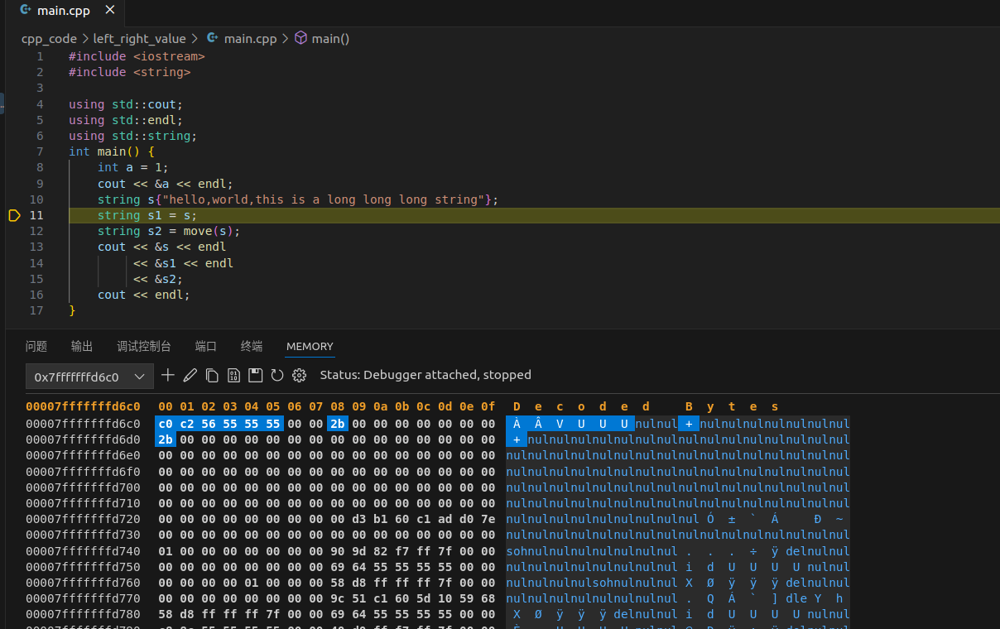
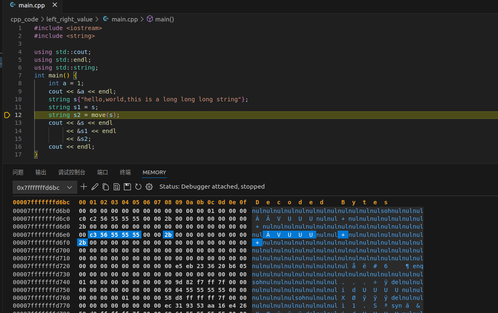
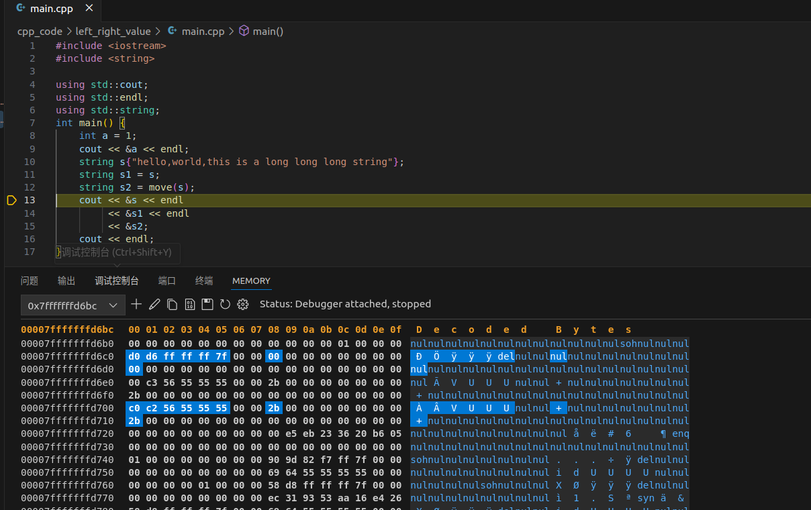

## 左值和右值
左值就是在等号左边，有名字，可以取地址的变量
右值就是在等号右边，不可以取地址的临时变量
这种说法不绝对，但大致可以区分

## 左值引用和右值引用
- 左值引用只能引用左值，带有const的左值引用可以引用右值
- 左值引用避免了对象的深拷贝，但是会存在问题
  1. 函数内局部变量返回时会销毁
  2. 函数返回值作为一个临时变量，如果没有给它赋值给其他变量，则返回的对象空间无法释放
```cpp
int a = 10;
int& b = a;
const int& c = 10;//const引用右值
```
- 右值引用只能引用右值，右值引用可以引用被move的左值
```cpp
int&& a = x + y;
int&& a = func();

int a = 1;
int&&b = std::move(a);
```
## 右值引用和move
- 实际上右值引用给了是给临时变量一个名称，所以右值引用是左值
```cpp
#include <iostream>
#include <string>
using namespace std;

void change(int&& right_value) {
    right_value = 8;
}

int main() {
    int a = 5;                         // a是个左值
    int& ref_a_left = a;               // ref_a_left是个左值引用
    int&& ref_a_right = std::move(a);  // ref_a_right是个右值引用

    change(a);            // 编译不过，a是左值，change参数要求右值
    change(ref_a_left);   // 编译不过，左值引用ref_a_left本身也是个左值
    change(ref_a_right);  // 编译不过，右值引用ref_a_right本身也是个左值

    change(std::move(a));            // 编译通过
    change(std::move(ref_a_right));  // 编译通过
    change(std::move(ref_a_left));   // 编译通过

    change(5);  // 当然可以直接接右值，编译通过
}
```
### 移动构造函数
- 拷贝构造时以**const左值引用**为参数，可以接收左值和右值，会进行深拷贝
```cpp
#include <iostream>
#include <string>

using std::cout;
using std::endl;
using std::string;
int main() {
    cout << &a << endl;
    string s{"hello,world,this is a long long long string"};
    string s1 = s;
    string s2 = move(s);
    cout << &s << endl
         << &s1 << endl
         << &s2;
    cout << endl;
}
```
> 测试代码时发现一个有意思的点：当字符串较短时，string是在栈上分配空间的
> 转移资源：
> 1. 栈上分配空间，把长度改为0,字符串首字节改为0
> 2. 堆上分配空间，见图
> 
> =
> 
### 移动赋值函数
- 拷贝赋值时以**const左值引用**为参数，可以接收左值和右值
- 移动赋值时以**右值引用**为参数，则会接受右值和move后的左值
```cpp
string s = "hello";
string s1 s2;
s1 = s;
s2 = std::move(s);
```
### 使用场景
1. 解决了函数局部变量返回值的问题，如果没有拷贝移动或赋值移动函数，返回时会先深拷贝到临时变量，再从临时变量拷贝或赋值到外面的接收变量中，虽然编译器可以将中间过程优化掉，但还是做了一次深拷贝
如果A实现了拷贝移动或赋值移动，则可以避免深拷贝
```cpp
A func(){
  A a;
  return a
}
int main(){
  A ret = func();
  return 0
}
```
> **返回对象时的问题**：上述说的十分模糊，下面是详细说明Copy elision机制
```cpp
#include <cstring>
#include <iostream>
using namespace std;

class myString {
   public:
    char* s;

   public:
    myString(const char _s[] = 0) {
        if (_s) {
            s = new char[strlen(_s) + 1];
            strcpy(s, _s);
        } else {
            s = new char[1];
            *s = '\0';
        }
        cout << "默认构造" << endl;
    }
    myString(const myString& _s) {
        s = new char[strlen(_s.s) + 1];
        strcpy(s, _s.s);
        cout << "拷贝构造" << endl;
    }
    myString(myString&& _s) {
        s = _s.s;
        _s.s = 0;
        cout << "移动构造" << endl;
    }
    myString& operator=(const myString& _s) {
        delete[] s;
        s = new char[strlen(_s.s) + 1];
        strcpy(s, _s.s);
        cout << "拷贝赋值" << endl;
        return *this;
    }
    myString& operator=(myString&& _s) {
        delete[] s;
        s = _s.s;
        _s.s = 0;
        cout << "移动赋值" << endl;
        return *this;
    }
    ~myString() {
        delete[] s;
    }
    char* get_s() {
        return s;
    }
};

myString s1 = "hello,world";
myString s2 = s1;//拷贝构造
myString s3 = move(s1);//移动构造
```
```cpp
// 情况一
myString func() {
    cout << "in func" << endl;
    myString S("hello");
    cout << "in func" << endl;
    return S;
}

int main() {
    myString s1;
    s1 = func();
    cout << endl;
    myString s2 = func();

    
}
``` 
> 所有的情况，若没有提供移动函数，会用拷贝函数

> `g++ -std=c++11 -fno-elide-constructors main.cpp -o main`**cpp11不开优化**
- 默认构造：s1
- in func
- 默认构造：S
- in func
- 移动构造：temp
- 移动赋值：temp—>s1
<br>
- in func
- 默认构造：S
- in func
- 移动构造：temp
- 移动构造：s2

> `g++ -std=c++17 -fno-elide-constructors main.cpp -o main`**cpp17不开优化**
- 默认构造
- in func
- 默认构造
- in func
- 移动构造
- 移动赋值
<br>
- in func
- 默认构造
- in func
- 移动构造:这里少了一次移动构造，当没有copy elision的时候，为什么C++17 只被move了一次？看汇编会发现，C++17将temp-space等同于v-space


> `g++ -std=c++11/17 main.cpp -o main`**开优化**
- 默认构造：s1
- in func
- 默认构造:S
- in func
- 移动赋值:S->s1
<br>
- in func
- 默认构造
- in func
> 少了两次move是因为直接在S就是s2
```cpp
// 情况二
myString func() {
    cout << "in func" << endl;
    myString S("hello");
    cout << "in func" << endl;
    return move(S);
}

int main() {
    myString s1;
    s1 = func();
    cout << endl;
    myString s2 = func();
}
```
> 不开优化，结果和之前一样

> `g++ -std=c++11/17 main.cpp -o main`**开优化**
- 默认构造
- in func
- 默认构造
- in func
- 移动赋值(如果没有移动赋值这里是拷贝赋值//因为const引用可以给右值)
<br>
- in func
- 默认构造
- in func
- 移动构造：这里多了一次移动构造
> 这里显示使用move语义反而要多一次构造，move影响了编译器优化

**总结**：
```cpp
// 写法一
Verbose create() {
  return Verbose();
}
//写法二
Verbose create() {
  Verbose v;
  return v;
}
//写法三
Verbose create() {
  Verbose v;
  return std::move(v);
}
```
RVO是返回值优化，就是将返回值的创建省略了。
NRVO是函数内具有名字的局部变量充当返回值的时候，它的创建也被省略了。它们的省略结果都是在最终的变量里创建对象。
由上述栗子可以看到，函数返回的三个过程
1. construct f
2. f->temp
3. temp->v

不开优化
c++11：1.2.3
c++17: 1,3(f->v)(相当于默认RVO)
开优化
construct v

在C++没有move的时候，很多编译器实现就支持RVO(return value optimization)和NRVO(named return value optimization)。这两种优化用于在返回值的时候避免不必要的copy。在C++11以后，引入了move，move的存在与copy elision交织在一起。
move可能会影响RVO，NRVO优化

**写法一是推荐的，写法二场景需要就推荐，而写法三是不推荐的。**
## 完美转发
### 引用折叠
在某些情况下，可能会出现引用折叠`& &&，&& &，&& &&，& &`的四种情况，两条规则
1. 带&的会折叠成&
2. && &&折叠成&&
- 万能引用
lvalue会被推导为T& 
rvalue会被推导为T
函数内T& &&会被折叠为T&，T&&不变
```cpp
#include<iostream>
using namespace std;
//template
template <typename T>
void print(T&& t) {
    cout << "this is T&&" << endl;
}

int main() {
    int a = 1;
    print(a);
    print(move(a));
    return 0;
}
//cpp insight
/* First instantiated from: test.cpp:21 */
#ifdef INSIGHTS_USE_TEMPLATE
template <>
void print<int&>(int& t) {
    std::operator<<(std::cout, "this is T&&").operator<<(std::endl);
}
#endif

/* First instantiated from: test.cpp:22 */
#ifdef INSIGHTS_USE_TEMPLATE
template <>
void print<int>(int&& t) {
    std::operator<<(std::cout, "this is T&&").operator<<(std::endl);
}
#endif
```
- 使用using
```cpp
using T = int&;
using P = int&&;

int main() {
    int a = 0;
    T b = a;
    T& c = a;
    T&& d = a;
    P bb = move(a);
    P& cc = a;
    P&& dd = move(a);
    return 0;
}
```
### 万能引用
```cpp
void Func(int& x) {
    cout << "左值引用" << endl;
}

void Func(const int& x) {
    cout << "const左值引用" << endl;
}

void Func(int&& x) {
    cout << "右值引用" << endl;
}

void Func(const int&& x) {
    cout << "const右值引用" << endl;
}

template <typename T>
void f(T&& t)  // 万能引用
{
    Func(t);  // 根据参数t的类型去匹配合适的重载函数
}

int main() {
    int a = 4;  // 左值
    f(a);

    const int b = 8;  // const左值
    f(b);

    f(10);  // 10是右值

    const int c = 13;
    f(std::move(c));  // const左值被move后变成const右值

    return 0;
}
// 左值引用
// const左值引用
// 右值引用
// const右值引用
```
函数模板的&&是万能引用，注意要在**在推导时**，下面那个栗子就不是万能引用，因为对象创建时已经进行了推导，调用func是T已经确定类型
```cpp
template<typename T>
class A
{
    void func(T&& t);  // 模板实例化时T的类型已经确定，调用函数时T是一个确定类型，所以这里是右值引用
};
```

### 完美转发

如前文所说右值引用后的变量其实是左值，如何在参数传递时保持原来的右值语义？使用完美转发，它会根据需要变成左值或右值
```cpp
template<typename T>
void print(T & t){
    std::cout << "Lvalue ref" << std::endl;
}

template<typename T>
void print(T && t){
    std::cout << "Rvalue ref" << std::endl;
}

template<typename T>
void testForward(T && v){ 
    print(v);//v此时已经是个左值了,永远调用左值版本的print
    print(std::forward<T>(v)); //本文的重点
    print(std::move(v)); //永远调用右值版本的print

    std::cout << "======================" << std::endl;
}

int main(int argc, char * argv[])
{
    int x = 1;
    testForward(x); //实参为左值
    testForward(std::move(x)); //实参为右值
}
```

#### forward原理
```cpp
template <typename _Tp>
constexpr _Tp&& forward(typename std::remove_reference<_Tp>::type& __t) noexcept {
    return static_cast<_Tp&&>(__t);
//typename std::remove_reference<_Tp>::type& __t强制变为左值引用
}
```
- 假设传入实参T(这里T理解为具体类型)为左值
```cpp
testForward<T&>(T&)
std::forward<T&>(T&)
static_cast<T& &&>(T&)//lvalue
```
- 假设传入实参T(这里T理解为具体类型)为右值
```cpp
testForward<T>(T&&)
std::forward<T>(T&)
static_cast<T&&>(T&)//lvalue
```

## 参考链接
[left and right value](https://www.cnblogs.com/david-china/p/17080072.html)
[left and right value-2](https://zhuanlan.zhihu.com/p/335994370)
[move](https://zhuanlan.zhihu.com/p/374392832)
[RVO NRVO](https://zhuanlan.zhihu.com/p/379566824)
[这个很全](https://cloud.tencent.com/developer/article/1561681)
[forward](https://lamforest.github.io/2021/04/29/cpp/wan-mei-zhuan-fa-yin-yong-zhe-die-wan-neng-yin-yong-std-forward/)