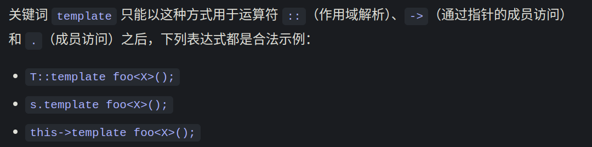

# 歧义
两中关键字消除歧义
## typename
```cpp
template <class T>
class A {
   public:
    using X = int;
};

template <class U>
class B {
   public:
    // using Y = U::X;  // error
    using Y = typename U::X;  // ok
};

int main() {
    B<A<int>> b;
}

```
## template
```cpp
#include <iostream>
using namespace std;

template <typename T>
struct S {
    template <typename U>
    void foo() {}

    template <typename V>
    static void aoo() {
    }
};

template <typename T>
void bar() {
    S<T> s;
    // s.foo<T>();           // error
    s.template foo<T>();  // OK

    // S<T>::aoo<int>();           // error
    S<T>::template aoo<int>();  // ok
}

int main() {
    S<int> s;
    s.foo<int>();  // ok

    S<int>::aoo<int>();
}
当S的类型不确定时，使用S的实例化s

```
