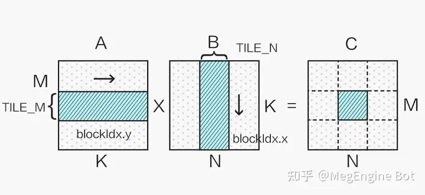
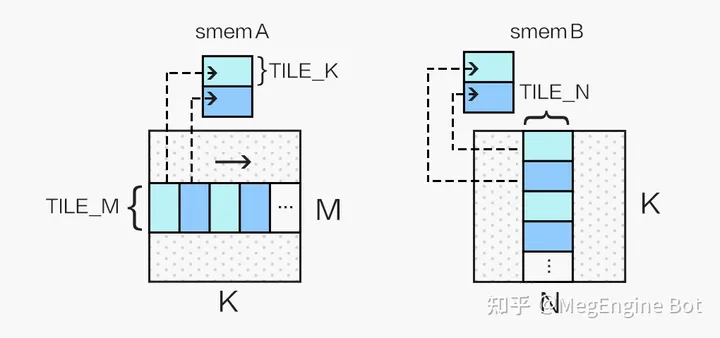
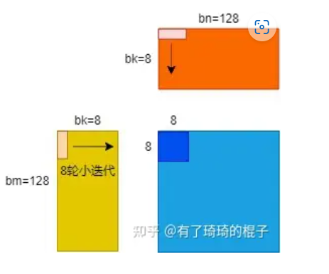

> cuda gemm
> cublas
> cutlass

## C = A * B + C
根据在cpu上单核cpu gemm那篇笔记
矩阵运算加速的核心是减少内存的移动，当一块内存从慢内存移到快内存上时，尽量完全利用后再换出
c： 2MNK
m： 
- 在忽略内存分层的情况下，内存访问次数 MNK + MNK + 2MNK（A，B，C）
- 考虑到C矩阵的单个元素可以使用寄存器存储，可以简化为 MNK + MNK + 2MN
- 因此问题在与让A，B的访存次数2MNK中有较多次数是访问快内存，而非慢内存，理想状况下，快内存可以装的下所有数据，这时对慢内存的访问次数最少需要MK + KN次。实际情况中，快内存装不下所有数据，这时遵循的原则是**尽量使快内存中的数据充分利用**

在gpu中，根据内存结构和计算结构，每个block负责C的一小块计算

内存结构可以划分为global，shared，register三级

首先是把数据从global->shared，当如上图分块时，每一小块都是只换入shared一次

同样把数据从shared->register,如上图
可以发现，为了让数据在快内存中充分利用，采用的都是列 * 行的形态，而非行 * 列

## 参数
结合数据预取，确定参数
1. global
