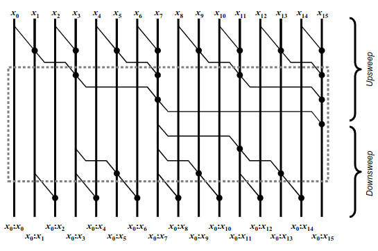
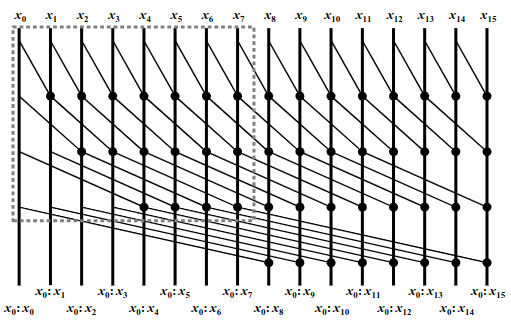
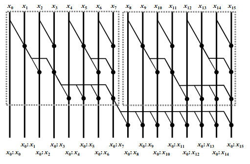

算法层面可以参照cs260的课程
<!--more-->

## 基本算法
> 还有其他算法但是大概似乎只是下面这三个算法的别名？
1. brent-kung

W = O(n) D = 2logn
访存：这个算法相当于两次reduce操作，这里做相邻配对，因此bank conflict很多，按照交错配对重新排下内存就可以避免
负载：不均衡，很多线程空闲
```cpp
__global__ void scan(float* input) {
    __shared__ float array[thread_num_per_block];
    int tid = threadIdx.x;
    int idx = blockIdx.x * blockDim.x + tid;
    array[tid] = input[idx];
    __syncthreads();

    for (int i = 1; i <= thread_num_per_block / 2; i *= 2) {
        if (2 * i - 1 + tid * 2 * i < thread_num_per_block) {
            array[2 * i - 1 + tid * 2 * i] += array[i - 1 + tid * 2 * i];
        }
        __syncthreads();
    }
    for (int i = thread_num_per_block / 4; i >= 1; i /= 2) {
        if (2 * i - 1 + tid * 2 * i + i < thread_num_per_block) {
            array[2 * i - 1 + tid * 2 * i + i] += array[i - 1 + tid * 2 * i + i];
        }
        __syncthreads();
    }
    input[idx] = array[tid];
}
```
1. kogge-stone

W = O(nlogn) D = logn
访存：没有bank conflict
负载：还行，最多有一半线程空闲
```cpp
__global__ void scan(float* input) {
    __shared__ float array[thread_num_per_block];
    int tid = threadIdx.x;
    int idx = blockIdx.x * blockDim.x + tid;
    array[tid] = input[idx];
    __syncthreads();
    for (int i = 1; i <= thread_num_per_block / 2; i *= 2) {
        if (tid < thread_num_per_block - i)
            array[tid + i] += array[tid];
        __syncthreads();
    }
    input[idx] = array[tid];
    return;
}
```
1. sklansky

W = O(nlogn) D = logn
访存：可以看到随着循环，访问位置越来越连续，bank conflict越少
负载：完美
```cpp
__global__ void scan(float* input) {
    __shared__ float array[thread_num_per_block];
    int tid = threadIdx.x;
    int idx = blockIdx.x * blockDim.x + tid;
    array[tid] = input[idx];
    __syncthreads();

    for (int i = 1; i <= thread_num_per_block / 2; i *= 2) {
        if(tid<thread_num_per_block/2){
            array[tid + i + tid / i * i] += array[i - 1 + tid / i * 2 * i];
        }
        __syncthreads();
    }
    input[idx] = array[tid];
    return;
}
```
## warp
这里使用kogge-stone算法
## block
1. reduce then scan
2. scan then propagate

## device

