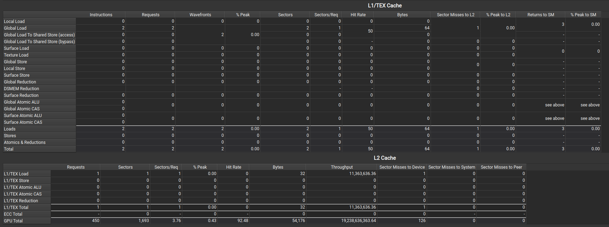

# gmem
## cache line的长度是128B，一次取数是32B
实验设计：
### 一
threads = 32 
data = int[32]
首先tid0-7取data[0-7]
只有tid8-15取data[8-15]
观察cache命中率
```cpp
__global__ void testCache(int* da, int N) {
    int tid = threadIdx.x;
    if (tid < 8)
        int a = da[tid];
    if (tid >= 8 && tid < 16)
        int a = da[tid];
}
```

可以看到l1 cache 和 l2 cache的访问命中率都是0

### 二
threads = 32 
data = int[32]
首先tid0-3取data[0-3]
只有tid4-7取data[4-7]
观察cache命中率
```
__global__ void testCache(int* da, int N) {
    int tid = threadIdx.x;
    if (tid < 4)
        int a = da[tid];
    if (tid >= 4 && tid < 8)
        int a = da[tid];
}
```

可以看到第二次命中

## throughput
全局内存的访问模式
只要内部32B是连续的，若干个32B间隔对速度有影响吗
> 对4090,带宽约1TB/s，这个数值是单向数值
### 一
block = 1024
thread = 1024
data = int[1024 * 1024 * 1024]
```cpp
__global__ void test(int* da, int* dr, int N) {
    int tid = (blockDim.x * blockIdx.x + threadIdx.x);
    for (; tid < N; tid += blockDim.x * gridDim.x)
        int a = da[tid];
}

```

### 二
上图显示，连续取数，1seq=4sector
我觉得这个不能反映真实的带宽，因为当32个thread取的数分散到32个sector中，即1seq=32sector,同样可以完成4GB的取数（g->l2）
```cpp
__global__ void test(int* da, int* dr, int N) {
    int tid = (blockDim.x * blockIdx.x + threadIdx.x) * 8;
    for (; tid < N; tid += blockDim.x * gridDim.x * 8)
        int a = da[tid];
}
```

这样会更接近带宽
### 三
进一步，若这32个sector是分散的
```cpp
__global__ void test(int* da, int* dr, int N) {
    int tid = (blockDim.x * blockIdx.x + threadIdx.x) * 16;
    for (; tid < N; tid += blockDim.x * gridDim.x * 16)
        int a = da[tid];
}
```

可以发现并不影响带宽