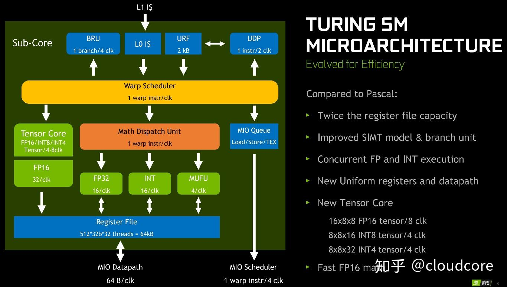
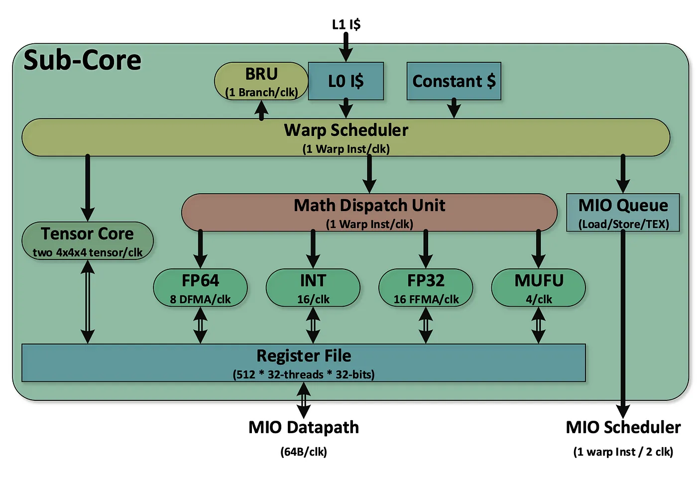

<!--more-->

## arithmetic throughtput
[reference](https://docs.nvidia.com/cuda/cuda-c-programming-guide/index.html#arithmetic-instructions)

## pipline
### v100
- 1个sm包含4个smsp
- 1个smsp包含1个warp sheduler和dispatch
- 1个sm最多64个warp，即一个smsp的warp sheduler的slot为16
> GV100 has several math pipelines:
FMA pipe - executes FP32 instructions and IMAD (integer multiply and add)
ALU pipe - executes INT32 (not IMAD), logical operations, binary operations, and data movement operations
FP64 pipe - executes FP64 instructions
FP16 pipe - executes FP16x2 instructions
Tensor pipe - executes matrix multiply and accumulate instructions
<h>
The FP64, FP16, and Tensor pipe use the same dispatch port so you cannot dispatch to these pipes at the same time.
<h>
The FMA and ALU pipeline each have separate dispatch ports. It takes 2 cycles to dispatch a warp to the each of these pipes (16 cores).
Concurrent execution is done by alternating instruction dispatch to different pipes.

[reference](https://forums.developer.nvidia.com/t/int-32-and-fp64-can-be-used-concurrently-in-the-volta-architecture/108729/3)

### turing
F64，应该是和Tensor Core、F16

### A100

## stall reason
### selected
> Warp was selected by the micro scheduler and issued an instruction.

指令选中发射的cycle，默认是1
### long scoreboard
> Warp was stalled waiting for a scoreboard dependency on a L1TEX (local, global, surface, texture) operation.

指令对global mem data有数据依赖
### short scoreboard
> Warp was stalled waiting for a scoreboard dependency on a MIO (memory input/output) operation (not to L1TEX). The primary reason for a high number of stalls due to short scoreboards is typically memory operations to shared memory.

指令对shared mem data有数据依赖

### mio throttle

### barrier
> Warp was stalled waiting for sibling warps at a CTA barrier. A high number of warps waiting at a barrier is commonly caused by diverging code paths before a barrier.

同步指令

### dispatch
[reference](https://forums.developer.nvidia.com/t/what-cause-dispatch-stall-how-to-avoid-it/233021)
产生原因寄存器板块冲突
测试代码cuda_code/assemble
[register bank conflict and reuse](https://zhuanlan.zhihu.com/p/373063821)

### wait
> Warp was stalled waiting on a fixed latency execution dependency. Typically, this stall reason should be very low and only shows up as a top contributor in already highly optimized kernels. 

对单个warp的来说，前后指令的固定停顿周期
### math pipe throttle
> Warp was stalled waiting for the execution pipe to be available. This stall occurs when all active warps execute their next instruction on a specific, oversubscribed math pipeline. 

对于warp间，指令的计算资源不足

