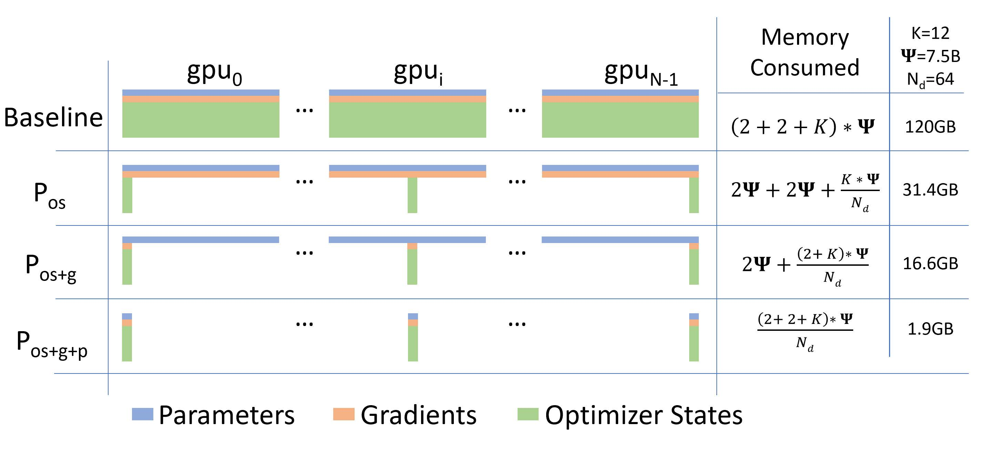

# 数据并行
数据并行用在训练，推理时就是组batch
每张卡上存储完整的模型参数，每张卡输入不同的batch，最后把这些batch计算的梯度合并
## dp
一个server,若干个worker

具体过程由上图所示
1. gpu1把batch分割成small batch和完整参数下发给其他gpu
2. gpu1-4做正向计算得到结果
3. gpu2-4把结果给gpu1
4. gpu1计算4个loss和loss的梯度，并把梯度返回给gpu-2-4
5. gpu1-4跟据loss的梯度更新自己的梯度
6. gpu2-4把更新后的梯度给gpu1
7. gpu1合并完整的梯度后，更新参数，回到1

通信量分析
假设传输数据为参数和梯度，参数量为p
节点数为n
主节点：
传入梯度：(n-1)p
传出参数：(n-1)p
从节点
传入参数：p
传出梯度：p

## ddp
没有server，所有节点等同，同步梯度，之后各自的节点独立计算新的参数
### ring-allreduce

两个阶段
- scatter reduce
这里的a，b，c，d，e，代表一个桶有若干参数，这一阶段每个gpu会合并自己桶的梯度

- all gather
这一阶段把梯度广播出去

通信量分析
假设传输数据为梯度，参数量为p
节点数为n
scatter reduce 传入/传出: (n-1) * (p/n)
all gather 传入传出: (n-1) * (p/n)

## deepspeed zero
数据并行的一个致命问题是，并没有对模型参数进行划分，每张卡上存储完整的模型参数，当模型很大一张卡存储不下，怎么办？

模型参数
1. 参数
2. 梯度
3. 优化器状态

## zero1
每张卡只存储部分优化器状态
前向：不需要通信
后向：
1. 每张卡都要计算各自的梯度
2. 之后每张卡把接收汇总自己负责的那部分梯度，传出其他部分的梯度
3. 每张卡依据汇总的梯度更新相应优化器状态和参数
4. 每张卡传出更新的参数和梯度，接收其他卡更新的参数和梯度

通信量分析
收集梯度： 传入/传出 (n-1)*(p/n)
参数广播： 传入/传出 (n-1)*(p/n)

> 和原始ddp的区别在于，原始ddp是收集梯度，直接广播梯度，之后各节点独立计算新的参数，zero1是，收集梯度，各节点计算部分新的参数，再广播，减少计算量的同时，节约内存，且通信数据量不变

## zero2
与zero1类似，个人理解zero1有点冗余？zero2才是完整版

## zero3
zero3把参数也分割
正向传播需要参数：(n-1)*(p/n)
反向传播
计算梯度需要参数：(n-1)*(p/n)
广播梯度：(n-1)*(p/n)