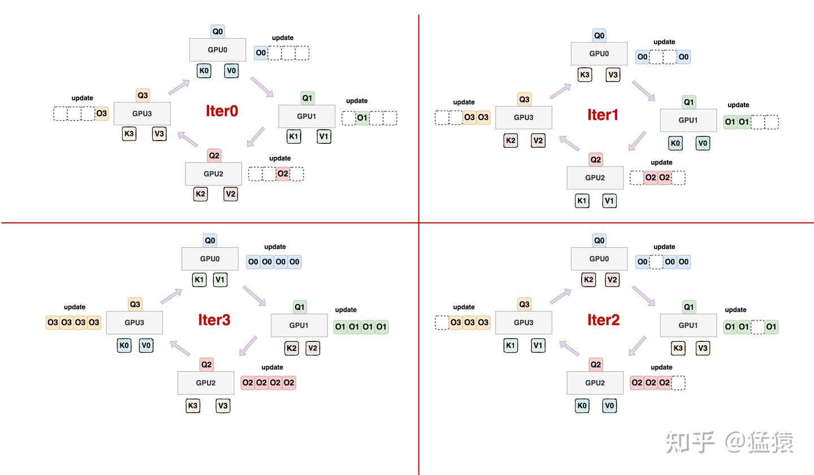

# 序列并行

## ring attention

分布式的flash attention 每张卡固定Q，通信KV

还要考虑不同的场景
1. train
2. prefill
3. decode 
4. causal mask的负载不均 
### reference
[1](https://zhuanlan.zhihu.com/p/683714620)
[2](https://zhuanlan.zhihu.com/p/9816504195)

## deepspeed Ulysses
## Megatron