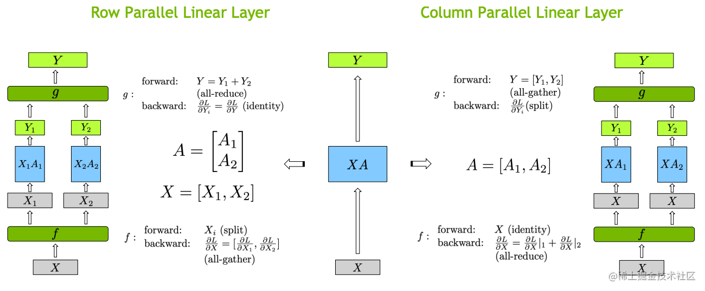
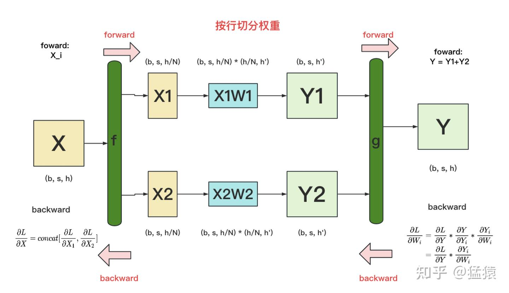
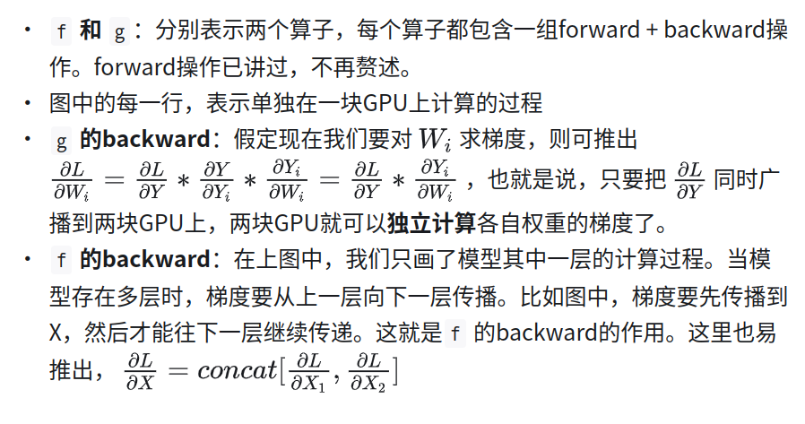
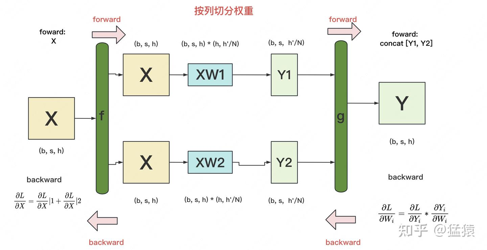
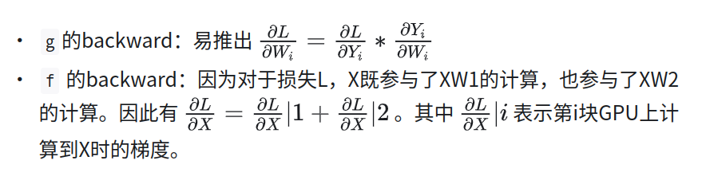
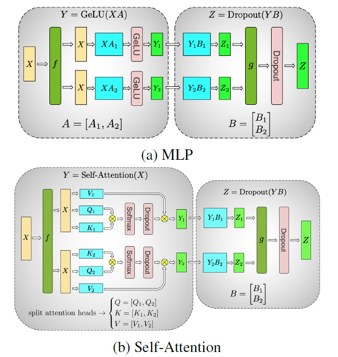
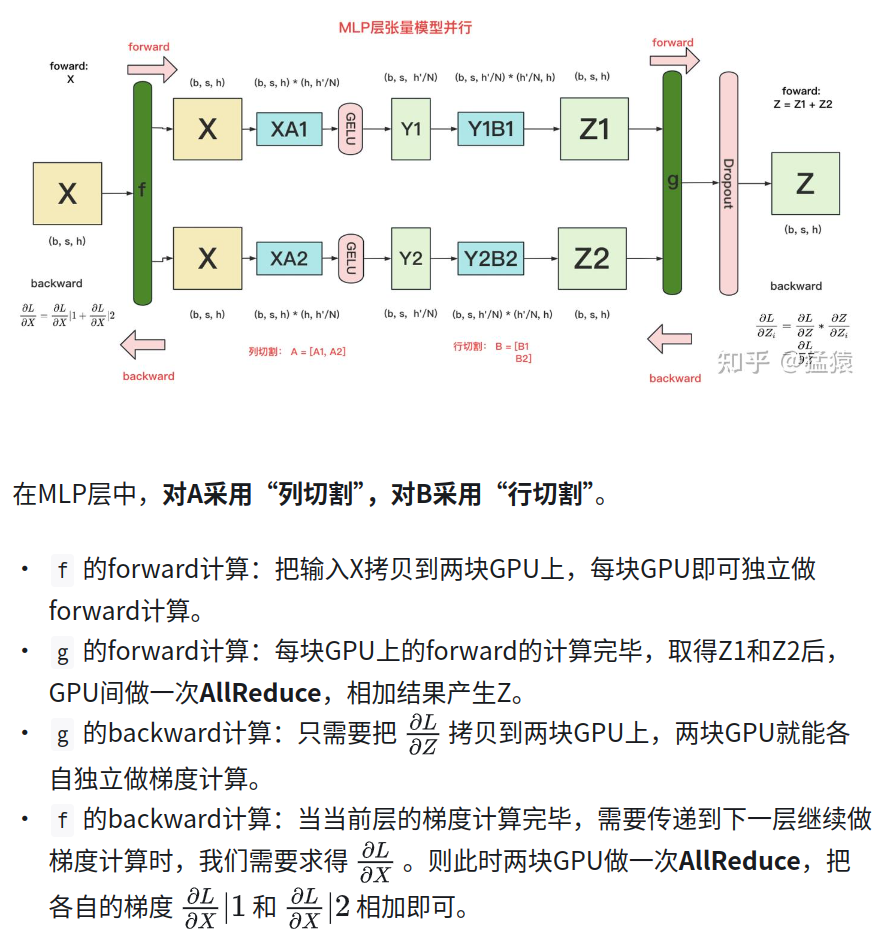
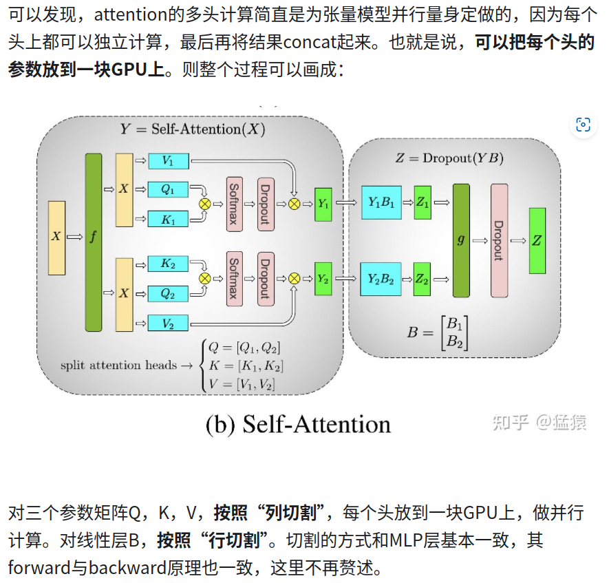
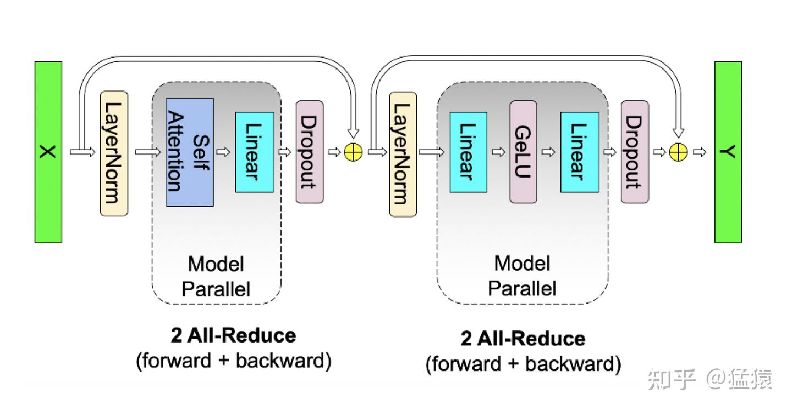

# 张量并行

## 策略

张量并行有两种策略X*A=Y
## A矩阵按行切，这时X矩阵需要按列切，最后做all-reduce操作

## A矩阵按列切，最后做all-gather操作

## transformer

### MLP层 
X * A + gelu -> Y 
Y * B + droupout -> O
对A按列切得到[Y1,Y2]之后符合对B按行切的形态

### selfattention
多头天然符合张量并行策略

## summary

对bs * seq * dim的数据量做4次all reduce 