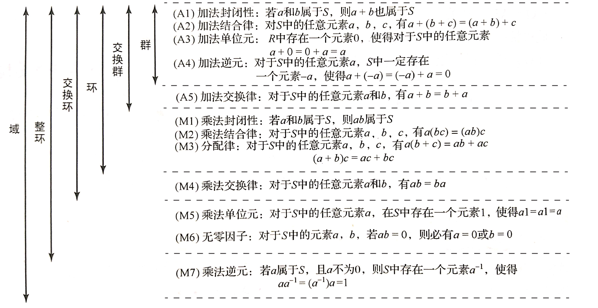

这部分是与环和域相关的内容
<!--more-->

## 环
1. 封闭性
2. 结合律
3. 单位元
4. 逆元

群：1,2,3,4
么半群：1,2,3
半群：1,2
广群：1
<h>
环： 加法群+乘法半群+分配律
加法单位元：零元$\theta$
乘法单位元：单位元$e$

<h>
含幺环：加法群+乘法幺半群+分配律
交换环：加法群+乘法半群+乘法交换律+分配律

## 零元
- $e=\theta \rightarrow 平凡环：环中只有一个元素$
  $e \neq \theta \rightarrow 非平凡环$
- 零因子：$ab=\theta且a,b \neq \theta$
  
## 域
- 整环：非平凡含幺交换环+**无零因子**，例：整数环，模n（素数）整数环
  > 这里$Z_n$，n要求素数，因为若n不为素数，则存在零因子 
- 除环：$\{R/{\theta},*\}$是群，显然除环没有零因子
- 域：$\{R/{\theta},*\}$是阿贝尔群
- 域比整环多了有乘法逆元，域比除环多了乘法交换律
- 有限整环都是域

## 环的特征
环的特征：存在最小的正整数m使得环中任意元素a，累加m次为零元
- 含幺交换环：$ma=m(e*a)=me*a$，因此将环的特征转换成乘法单位元e的加法阶
- 整环：整环的特征是0或素数
  > $me=0，若m=st(1<s,t<m)，则(se)*(te)=0，即存在零因子，与整环矛盾$
- 域的特征等于0或素数，有限域的特征是素数

## 子环和理想
### 子环
判断R的子环S：
1. 加法子群：$a-b \in S$
2. 乘法封闭性：$ab \in S$

> 环和子环的单位元没有任何联系！
> 从加法角度，子环一定是正规子群，从乘法角度，子环只要求了封闭性和结合律
### 理想 
>正规子群-->商群
理想子环-->商环

理想：R是环，I是R的非空子集
1. 加法子群：$a-b \in S$
2. 乘法吸收律：$\forall r \in R,\forall a \in I \Rightarrow ra \in I(ar \in I)$

主理想：$R是环，a \in R，aR(Ra)称为由a生成的主理想$

### 商环
> 这里就解释为什么理想要求吸收律了

用加法构造陪集
对于加法，即商群$[a]_I+[b]_I=[a+b]_I$
对于乘法$[a]_I*[b]_I=[ab]_I\\(a+t)*(b+t')=ab+tb+at'+tt'\\tb+at'要为理想中的元素$
> 商环还有点东西，以及环同态，估计用不上，不看了
