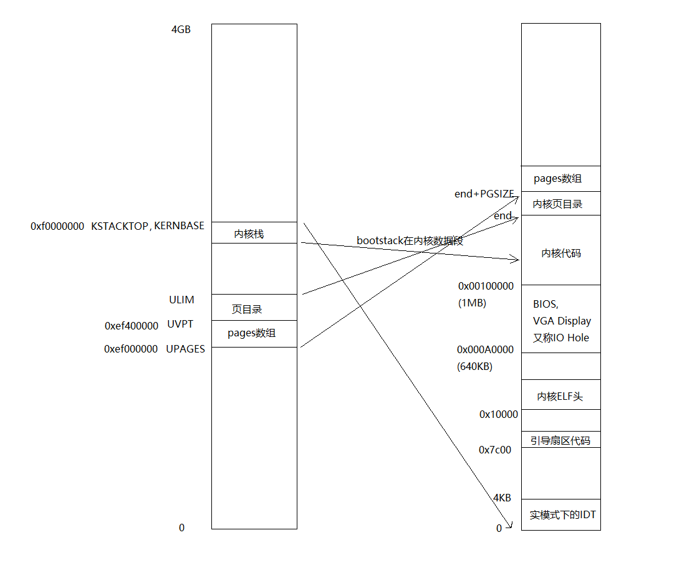

> lab2 内存管理
> 1. 物理内存管理
> 2. 虚拟内存页目录表和页表映射组件
> 3. 内核虚实映射

## kernel
ld脚本
```ld
/* Simple linker script for the JOS kernel.
   See the GNU ld 'info' manual ("info ld") to learn the syntax. */

OUTPUT_FORMAT("elf32-i386", "elf32-i386", "elf32-i386")
OUTPUT_ARCH(i386)
ENTRY(_start)

SECTIONS
{
	/* Link the kernel at this address: "." means the current address */
	. = 0xF0100000;

	/* AT(...) gives the load address of this section, which tells
	   the boot loader where to load the kernel in physical memory */
	.text : AT(0x100000) {
		*(.text .stub .text.* .gnu.linkonce.t.*)
	}

	PROVIDE(etext = .);	/* Define the 'etext' symbol to this value */

	.rodata : {
		*(.rodata .rodata.* .gnu.linkonce.r.*)
	}

	/* Include debugging information in kernel memory */
	.stab : {
		PROVIDE(__STAB_BEGIN__ = .);
		*(.stab);
		PROVIDE(__STAB_END__ = .);
		BYTE(0)		/* Force the linker to allocate space
				   for this section */
	}

	.stabstr : {
		PROVIDE(__STABSTR_BEGIN__ = .);
		*(.stabstr);
		PROVIDE(__STABSTR_END__ = .);
		BYTE(0)		/* Force the linker to allocate space
				   for this section */
	}

	/* Adjust the address for the data segment to the next page */
	. = ALIGN(0x1000);

	/* The data segment */
	.data : {
		*(.data)
	}

	.bss : {
		PROVIDE(edata = .);
		*(.bss)
		PROVIDE(end = .);
		BYTE(0)
	}


	/DISCARD/ : {
		*(.eh_frame .note.GNU-stack)
	}
}

```

```asm
# '_start' specifies the ELF entry point.  Since we haven't set up
# virtual memory when the bootloader enters this code, we need the
# bootloader to jump to the *physical* address of the entry point.
.globl		_start
_start = RELOC(entry)
```
1. kernel.ld文件指定了程序的入口地址`ENTRY(_start)`，从kernel.asm中可以看到`_start = RELOC(entry)`，链接时指定的虚拟基址是0xF0100000，而真正的装载地址是0x100000，因此在bootloader最后`((void (*)(void)) (ELFHDR->e_entry))();`时，真正的ip值是0x100000 
```asm
.data
###################################################################
# boot stack
###################################################################
	.p2align	PGSHIFT		# force page alignment
	.globl		bootstack
bootstack:
	.space		KSTKSIZE
	.globl		bootstacktop   
bootstacktop:

```
2. kernel把栈放置在.data中
```asm
movl	$(RELOC(entry_pgdir)), %eax
	movl	%eax, %cr3
	# Turn on paging.
	movl	%cr0, %eax
	orl	$(CR0_PE|CR0_PG|CR0_WP), %eax
	movl	%eax, %cr0

	# Now paging is enabled, but we're still running at a low EIP
	# (why is this okay?).  Jump up above KERNBASE before entering
	# C code.
	mov	$relocated, %eax
	jmp	*%eax
```
3. entry.S中使用暂时的页目录表和页表（存储在.data中）开启了分页模式
```c
__attribute__((__aligned__(PGSIZE)))
pte_t entry_pgtable[NPTENTRIES];
__attribute__((__aligned__(PGSIZE)))
pde_t entry_pgdir[NPDENTRIES] = {
    // Map VA's [0, 4MB) to PA's [0, 4MB)
    [0] = ((uintptr_t)entry_pgtable - KERNBASE) + PTE_P,
    // Map VA's [KERNBASE, KERNBASE+4MB) to PA's [0, 4MB)
    [KERNBASE >> PDXSHIFT] = ((uintptr_t)entry_pgtable - KERNBASE) + PTE_P + PTE_W};
```
4. 暂时的页目录表`int entry_pgdir[1024]`页表`entry_pgtable[1024]`共两个页大小，第一个页是页目录表，其中第0个表项和kernbase的表项指向页表的地址，故可查表的虚拟内存空间是一个页能表示的大小，4MB
5. 在ld脚本中定义了两个符号，edata和end，值为地址，分别指向.bss段的开始和末尾
## 总结
1. 分段不变使用的gdt表在bootloader secotr（0x7c00）里面
2. 内核的栈定义在.data
3. 临时页表在数据段中
4. .bss段即(加载内核后内核代码的最后)声明了一个end标记，便于后续物理内存操作


## physical page manage
下图是**物理**内存的分布，**目前已经打开分页，所有的内存操作都是基于虚拟内存！！！**
物理页的管理思路是把空闲的页用链表串起来，分配时从head处摘下来，释放时加到head处
首先计算有多少物理页，每个物理页由struct PageInfo结构体表示，申请一个struct PageInfo的数组，数组的序号和实际物理页对应

映射方法：pmap.h
**这样可以做到实际物理页地址和struct page的序号映射，记录起始的位置，那么struct page的物理地址或虚拟地址都可以映射到对应页的物理地址**
内核虚拟地址和物理地址的映射为简单的加减KERNBASE常数


上图可以看到装载时.bss段刚好在末尾，因此可以把end地址当作"堆"的地址，随意申请内存
实验的第一个部分，就是制作一个物理页的管理表
1. `i386_detect_memory()`该函数读取cmos中的信息，查询可用内存大小，计算总页数
```cpp
pde_t* kern_pgdir;                       // Kernel's initial page directory
struct PageInfo* pages;                  // Physical page state array
static struct PageInfo* page_free_list;  // Free list of physical pages

struct PageInfo {
    struct PageInfo* pp_link;
    uint16_t pp_ref;
};

```
2. page_free_list是链表头指针，每次分配页时把头指针指向的页摘掉，头指针后移，释放页时把释放页接到list头的位置，更新page_free_list
3. 实验过程，首先申请空间，初始化pages表，处理目前已分配或不能使用的内存页
```c
struct PageInfo* page_alloc(int alloc_flags) {
    // Fill this function in
    struct PageInfo* ret = page_free_list;
    if (ret == NULL) {
        cprintf("page_alloc: out of free memory\n");
        return NULL;
    }
    page_free_list = ret->pp_link;
    ret->pp_link = NULL;
    if (alloc_flags & ALLOC_ZERO) {
        memset(page2kva(ret), 0, PGSIZE);
    }
    return ret;
}

```
4. 注意上面的page2kva函数（page addr to kernel virtual addr），真正需要memset的是这个pageInfo指向的物理页地址，根据(ret-pages) << PGSHIFT 的值得到
页的物理地址，之后在转换为虚拟地址使用memset

5. pp_ref是映射计数，记录这个实页有几个虚页映射，由之后的虚页映射时负责累加，释放页时要检查pp_ref是否为0

## Virtual Memory
页管理

第二部分主要实现map的工具函数
1. pagdir_walk：给定页目录表基址，和虚拟地址，查询页表对应项的地址，注意，**这个函数返回的地址是虚拟地址**
   1. 页目录表和页表中的地址都是物理地址！！！！！！！
   2. 若页表不存在，需要先申请一页当页表
2. boot_map_region：给定页目录表，虚拟地址和物理地址和大小和权限，建立虚实映射。一页一页遍历虚拟页，使用padir_walk填充页表即可，注意这个函数没有操作struct PageInfo的pp_ref，它只在最开始大批量映射已使用物理页时用到，在page_init中这些物理页pp_ref已经加了1

以下函数对外暴露，之后的实验会用到
3. page_insert:给定页目录表基址，和虚拟地址和struct PageInfo，映射struct PageInfo对应的物理页和虚拟地址
4. page_lookup：给定页目录表基址，和虚拟地址，返回对应的物理地址和struct PageInfo
5. page_remove: 给定页目录表基址，和虚拟地址，删除映射
## Map
使用boot_map_region映射即可
最后的映射图

## reference
[mit](https://pdos.csail.mit.edu/6.828/2018/labs/lab2/)
[reference](https://www.cnblogs.com/gatsby123/p/9832223.html)


