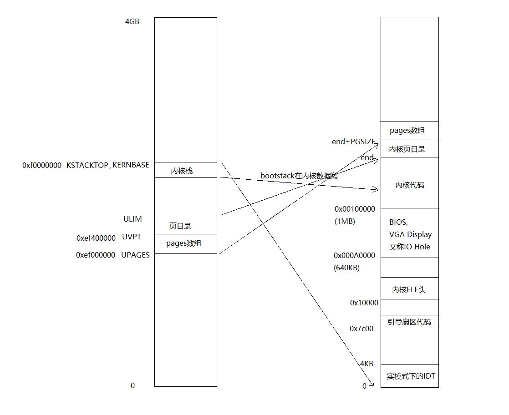

> 这个lab解决两个问题
> 1. 进程创建，内核态和用户态的切换
> 2. 中断处理

<!--more-->
## Map
```
/*
 * Virtual memory map:                                Permissions
 *                                                    kernel/user
 *    4 Gig -------->  +------------------------------+
 *                     |                              | RW/--
 *                     ~~~~~~~~~~~~~~~~~~~~~~~~~~~~~~~~
 *                     :              .               :
 *                     :              .               :
 *                     :              .               :
 *                     |~~~~~~~~~~~~~~~~~~~~~~~~~~~~~~| RW/--
 *                     |                              | RW/--
 *                     |   Remapped Physical Memory   | RW/--
 *                     |                              | RW/--
 *    KERNBASE, ---->  +------------------------------+ 0xf0000000      --+
 *    KSTACKTOP        |     CPU0's Kernel Stack      | RW/--  KSTKSIZE   |
 *                     | - - - - - - - - - - - - - - -|                   |
 *                     |      Invalid Memory (*)      | --/--  KSTKGAP    |
 *                     +------------------------------+                   |
 *                     |     CPU1's Kernel Stack      | RW/--  KSTKSIZE   |
 *                     | - - - - - - - - - - - - - - -|                 PTSIZE
 *                     |      Invalid Memory (*)      | --/--  KSTKGAP    |
 *                     +------------------------------+                   |
 *                     :              .               :                   |
 *                     :              .               :                   |
 *    MMIOLIM ------>  +------------------------------+ 0xefc00000      --+
 *                     |       Memory-mapped I/O      | RW/--  PTSIZE
 * ULIM, MMIOBASE -->  +------------------------------+ 0xef800000
 *                     |  Cur. Page Table (User R-)   | R-/R-  PTSIZE
 *    UVPT      ---->  +------------------------------+ 0xef400000
 *                     |          RO PAGES            | R-/R-  PTSIZE
 *    UPAGES    ---->  +------------------------------+ 0xef000000
 *                     |           RO ENVS            | R-/R-  PTSIZE
 * UTOP,UENVS ------>  +------------------------------+ 0xeec00000
 * UXSTACKTOP -/       |     User Exception Stack     | RW/RW  PGSIZE
 *                     +------------------------------+ 0xeebff000
 *                     |       Empty Memory (*)       | --/--  PGSIZE
 *    USTACKTOP  --->  +------------------------------+ 0xeebfe000
 *                     |      Normal User Stack       | RW/RW  PGSIZE
 *                     +------------------------------+ 0xeebfd000
 *                     |                              |
 *                     |                              |
 *                     ~~~~~~~~~~~~~~~~~~~~~~~~~~~~~~~~
 *                     .                              .
 *                     .                              .
 *                     .                              .
 *                     |~~~~~~~~~~~~~~~~~~~~~~~~~~~~~~|
 *                     |     Program Data & Heap      |
 *    UTEXT -------->  +------------------------------+ 0x00800000
 *    PFTEMP ------->  |       Empty Memory (*)       |        PTSIZE
 *                     |                              |
 *    UTEMP -------->  +------------------------------+ 0x00400000      --+
 *                     |       Empty Memory (*)       |                   |
 *                     | - - - - - - - - - - - - - - -|                   |
 *                     |  User STAB Data (optional)   |                 PTSIZE
 *    USTABDATA ---->  +------------------------------+ 0x00200000        |
 *                     |       Empty Memory (*)       |                   |
 *    0 ------------>  +------------------------------+                 --+
 *
```
lab2的map


## env(process)
和pages管理一样，申请struct env数组
```c
struct Env {
    struct Trapframe env_tf;  // Saved registers
    struct Env* env_link;     // Next free Env
    envid_t env_id;           // Unique environment identifier
    envid_t env_parent_id;    // env_id of this env's parent
    enum EnvType env_type;    // Indicates special system environments
    unsigned env_status;      // Status of the environment
    uint32_t env_runs;        // Number of times environment has run

    // Address space
    pde_t* env_pgdir;  // Kernel virtual address of page dir
};
```
其中struct Trapframe env_tf保存的是寄存器的值，即当前进程的状态。env_pgdir保存的是进程的页表，进程切换换的就是这两个东西
```c
struct Trapframe {
    struct PushRegs tf_regs;
    uint16_t tf_es;
    uint16_t tf_padding1;
    uint16_t tf_ds;
    uint16_t tf_padding2;
    uint32_t tf_trapno;
    /* below here defined by x86 hardware */
    uint32_t tf_err;
    uintptr_t tf_eip;
    uint16_t tf_cs;
    uint16_t tf_padding3;
    uint32_t tf_eflags;
    /* below here only when crossing rings, such as from user to kernel */
    uintptr_t tf_esp;
    uint16_t tf_ss;
    uint16_t tf_padding4;
} __attribute__((packed));
```


### create env
由于还没有文件系统，在编译时是把用户的程序elf文件嵌入到内核中，创建env需要读取保存在内核中的elf文件
```c
// 在env_init中建立了gdt表
struct Segdesc gdt[] =
    {
        // 0x0 - unused (always faults -- for trapping NULL far pointers)
        SEG_NULL,

        // 0x8 - kernel code segment
        [GD_KT >> 3] = SEG(STA_X | STA_R, 0x0, 0xffffffff, 0),

        // 0x10 - kernel data segment
        [GD_KD >> 3] = SEG(STA_W, 0x0, 0xffffffff, 0),

        // 0x18 - user code segment
        [GD_UT >> 3] = SEG(STA_X | STA_R, 0x0, 0xffffffff, 3),

        // 0x20 - user data segment
        [GD_UD >> 3] = SEG(STA_W, 0x0, 0xffffffff, 3),

        // 0x28 - tss, initialized in trap_init_percpu()
        [GD_TSS0 >> 3] = SEG_NULL
};
```
```c
// env_alloc创建了一个环境，load_icode加载elf文件
void env_create(uint8_t* binary, enum EnvType type) {
    // LAB 3: Your code here.
    struct Env* e;
    int r;
    if ((r = env_alloc(&e, 0) != 0)) {
        panic("create env failed\n");
    }
    cprintf("tag1\n");
    load_icode(e, binary);
    cprintf("tag2\n");
    e->env_type = type;
}
```

```c
// 创建新进程的页目录表，首先调用page_alloc函数申请一页内存，之后把内核的页目录表拷贝过来，更改UVPT那一项的映射
// 申请的是一页内存4kb，映射时填充的是页目录表中UVPT为基址的页目录表项，这个表项正常应该对应一页内存作为页表，实际对应的是页目录表自身，结果造成以UVPT为基址的4mb虚拟空间无法正常访问
// 作用：uvpt+id+offset实际可以访问到页表，首先uvpt的前10bit作为索引查询env_pgdir，返回的是env_pgdir自身的物理地址即env_pgdir，之后使用id 10bit作为索引查询env_pgdir，返回的是页目录表的第id项的物理地址，最后由该物理地址为基址，offset做偏移，查询到页表的第offset表项
// 主要还是为了访问页表，因为不递归映射访问页表很麻烦

static int env_setup_vm(struct Env* e) {
    int i;
    struct PageInfo* p = NULL;

    if (!(p = page_alloc(ALLOC_ZERO)))
        return -E_NO_MEM;
    p->pp_ref++;
    e->env_pgdir = (pte_t*)page2kva(p);
    memcpy(e->env_pgdir, kern_pgdir, PGSIZE);
    e->env_pgdir[PDX(UVPT)] = PADDR(e->env_pgdir) | PTE_P | PTE_U;
    return 0;
}

// 这个函数配置首先申请了页目录表，之后配置struct env结构体
int env_alloc(struct Env** newenv_store, envid_t parent_id) {
    int32_t generation;
    int r;
    struct Env* e;

    if (!(e = env_free_list))
        return -E_NO_FREE_ENV;

    // Allocate and set up the page directory for this environment.
    if ((r = env_setup_vm(e)) < 0)
        return r;

    // Generate an env_id for this environment.
    generation = (e->env_id + (1 << ENVGENSHIFT)) & ~(NENV - 1);
    if (generation <= 0)  // Don't create a negative env_id.
        generation = 1 << ENVGENSHIFT;
    e->env_id = generation | (e - envs);

    // Set the basic status variables.
    e->env_parent_id = parent_id;
    e->env_type = ENV_TYPE_USER;
    e->env_status = ENV_RUNNABLE;
    e->env_runs = 0;

    memset(&e->env_tf, 0, sizeof(e->env_tf));

    e->env_tf.tf_ds = GD_UD | 3;
    e->env_tf.tf_es = GD_UD | 3;
    e->env_tf.tf_ss = GD_UD | 3;
    e->env_tf.tf_esp = USTACKTOP;
    e->env_tf.tf_cs = GD_UT | 3;
 
    env_free_list = e->env_link;
    *newenv_store = e;

    cprintf("[%08x] new env %08x\n", curenv ? curenv->env_id : 0, e->env_id);
    return 0;
}

// 给e分配一块内存并填充页目录表和页表
static void region_alloc(struct Env* e, void* va, size_t len) {
    char* _va = ROUNDDOWN((char*)va, PGSIZE);
    char* _end = ROUNDUP((char*)(va) + len, PGSIZE);
    int npages = (_end - _va) / PGSIZE;
    for (int i = 0; i < npages; i++) {
        struct PageInfo* pages = page_alloc(0);
        if (pages == NULL) {
            panic("Allocate physical memory for environment env fails, there is no free physical pages for env\n");
        }
        int ret = page_insert(e->env_pgdir, pages, _va, PTE_U | PTE_W);
        if (ret < 0) {
            panic("Allocate physical memory for environment env fails, there is no free physical pages for mapping\n");
        }
        _va += PGSIZE;
    }
}
// 读取elf文件，模拟从文件读取，新申请一片内存，把内核中的用户程序移过去
// 详细看elf文件格式
static void load_icode(struct Env* e, uint8_t* binary) {
    struct Elf* ELFHDR = (struct Elf*)binary;
    struct Proghdr* ph;  // Program Header
    int ph_num;          // Program entry number
    if (ELFHDR->e_magic != ELF_MAGIC) {
        panic("binary is not ELF format\n");
    }
    ph = (struct Proghdr*)((uint8_t*)ELFHDR + ELFHDR->e_phoff);
    ph_num = ELFHDR->e_phnum;

    lcr3(PADDR(e->env_pgdir));//切换页表，用于填充env的表项

    cprintf("%x\n", e->env_pgdir);
    for (int i = 0; i < ph_num; i++) {
        if (ph[i].p_type == ELF_PROG_LOAD) {
            region_alloc(e, (void*)ph[i].p_va, ph[i].p_memsz);
            memset((void*)ph[i].p_va, 0, ph[i].p_memsz);
            memcpy((void*)ph[i].p_va, binary + ph[i].p_offset, ph[i].p_filesz);
        }
    }
    lcr3(PADDR(kern_pgdir));//切回来
    e->env_tf.tf_eip = ELFHDR->e_entry;
    region_alloc(e, (void*)(USTACKTOP - PGSIZE), PGSIZE);//给e分配栈空间
}
```
### **内核到env**！！！！！！！！！！！！
```c
void env_pop_tf(struct Trapframe* tf) {
    asm volatile(
        "\tmovl %0,%%esp\n"
        "\tpopal\n"
        "\tpopl %%es\n"
        "\tpopl %%ds\n"
        "\taddl $0x8,%%esp\n" /* skip tf_trapno and tf_errcode */
        "\tiret\n"
        : : "g"(tf) : "memory");
    panic("iret failed"); /* mostly to placate the compiler */
}

void env_run(struct Env* e) {
    if (curenv != NULL && curenv->env_status == ENV_RUNNING) {
        curenv->env_status = ENV_RUNNABLE;
    }
    curenv = e;
    e->env_status = ENV_RUNNING;
    e->env_runs++;
    cprintf("%x\n", e->env_pgdir);
    lcr3(PADDR(e->env_pgdir));
    env_pop_tf(&e->env_tf);
}
// 先切换页目录表
// 手动弹出Trapframe的前几项，跳过tf_trapno and tf_errcode，最后iret由硬件切换ip,cs,eflags,esp,ss
```
> x86架构的硬件机制，提供了复杂的转换机制，实际的内核并没有完全使用
> 1. 只用了gdt表
> 2. idt表中只使用了中断门
> 3. tr寄存器只指向一个tss段，只使用tss段的ss sp实现中断时的栈切换

## trap
第二部分是做中断初始化
1. 和env类似,在trap_init时做idt表，每个表项对应中断函数的入口地址，其中表项（门描述符）可以控制这个中断可否在用户态发生
2. **中断的过程**
   - 硬件通过tr寄存器找到内核栈ss sp，把ss，sp，eflags，cs，ip压栈
   - cs,ip切换到中断入口程序，同时ss,sp也会切换
   - 软件
        ```asm
        #define TRAPHANDLER_NOEC(name, num)					\
        .globl name;							\
        .type name, @function;						\
        .align 2;							\
        name:								\
        pushl $0;							\
        pushl $(num);							\
        jmp _alltraps
        ```
        ```asm
        _alltraps:
        pushl %ds
        pushl %es
        pushal
        pushl $GD_KD
        popl %ds
        pushl $GD_KD
        popl %es
        pushl %esp	//通过一系列压栈，以esp为基址的区域刚好是struct Trapframe，传参
        call trap       
        ```