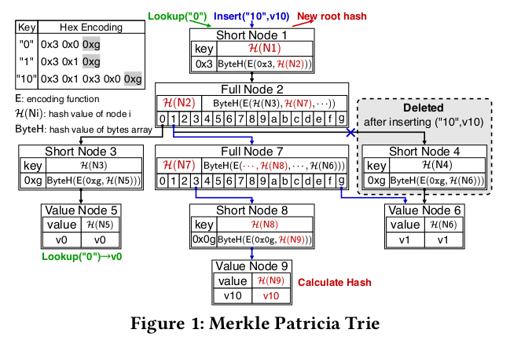
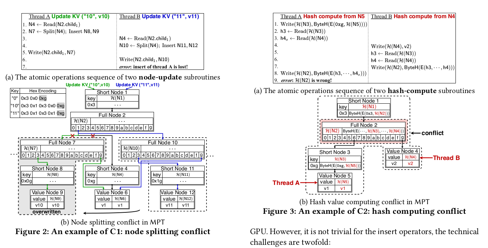
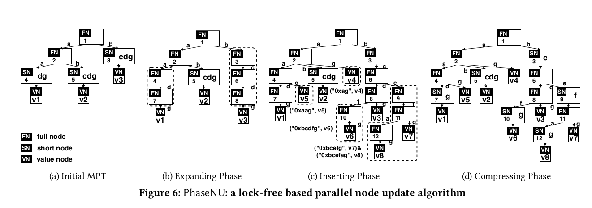
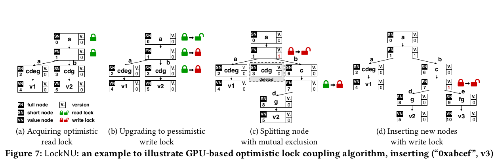
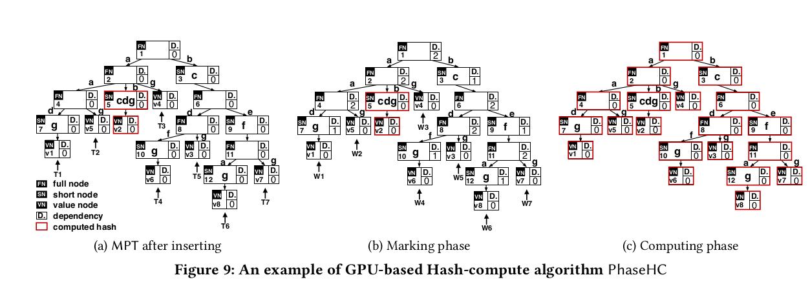

一篇论文
<!--more-->
## mpt模型

- short node 是压缩节点
- 0xg是结束标志
- path不定长

## 两种操作
1. lookup
2. insert

主要是insert并行的问题
- 建立mpt树阶段，node splitting conflict
- 更新hash阶段，hash computing conflict

## node splitting conflict
### lock free

将压缩节点展开，这样并行的控制逻辑相对简单，但是开销大
### lock based

1. optimistic read lock
它首先通过 node.ReadLockOrRestart() 获取读取节点的乐观读锁。如果锁不是空闲的，即写入器正在更新节点，则它将失败并从根重新启动。否则，它返回节点的版本计数器。乐观读锁由 node.ReadUnlockOrRestart(version) 释放，它将上一个版本计数器（即由 node.ReadLockOrRestart() 返回的）与当前版本计数器进行比较。如果上一个版本计数器已过时，则节点更新子程序的线程将失败并从根节点重新启动。
2. pessimistic write lock

三种情况
1. 遍历路径，mpt树存在当前路径的某节点，加read lock，释放上一个read lock
2. 不存在某节点，加write lock修改
3. 路径冲突，需要扩展，加write lock（分支点和之后需要删除的点）先扩展
### 锁
- pessimistic lock
1. 互斥锁：切换线程
2. 自旋锁：忙等
3. 共享锁（读写锁）
- optimistic lock
1. 仅在更新时判断数据是否被其他人修改，若修改则放弃操作
2. 本质不是锁
- cas算法
> CAS操作方式：即compare and swap 或者compare and set ,涉及到三个操作数，数据所在的内存地址（V），预期值（A），新值（B）。当需要更新时，判断当前内存地址的值与之前取到的值是否相等，若相等，则用新值更新，若不等则重试，一般情况下是一个自旋操作，即不断的重试。

> CAS是乐观锁的一种实现方式。虽然与加锁相比，CAS比较交换会使程序看起来更加复杂一些。但由于其非阻塞性，对死锁问题天生免疫，更重要的是，使用无锁的方式完全没有锁竞争带来的系统开销，也没有线程间频繁调度带来的开销，因此，它要比基于锁方式的实现拥有更优越的性能。　　
## hash computing conflict

- phase 1: marking counters
- phase 2: parallel

phase 2算法：每个叶节点作为入口启动一个线程，完成一个节点的计算后，父节点counter减一，若父节点counter不为0,结束该线程

